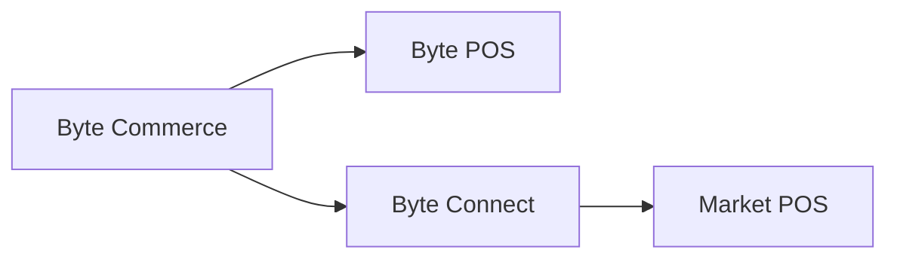

# Byte Connect

> In Atlas context, Byte Connect is the integration layer inside the Byte platform that becomes important whenever Byte Commerce needs to reach a non-Byte POS environment or external sales channel.

---

## Atlas Context

Within Atlas Wiki, Byte Connect should be understood as part of the broader **Atlas + Byte Commerce + Byte Portal** operating picture.

- **Atlas** is KFC's global front-end
- **Byte Commerce** handles transaction logic and order orchestration
- **Byte Portal** is the main admin surface for market and ops configuration
- **Byte Connect** is the integration layer used when external channel routing or non-Byte POS connectivity is involved

That means Byte Connect is not the customer-facing product and not the day-to-day operating UI, but it is still part of the Byte stack whenever markets depend on third-party channel integrations or a non-Byte POS setup.

---

## The Core Rule

If a market is **not** using **Byte POS**, then **Byte Connect must be onboarded as part of Byte Commerce onboarding**.

Byte Commerce is wired to talk directly to **Byte POS**. For non-Byte POS markets, Byte Connect sits in the middle and handles the integration path to the market POS.

---

## What Byte Connect Does

Byte Connect acts as an integration solution within the Byte platform, primarily managed through the **Business API**, that helps stores and brands connect Byte Commerce to:

- non-Byte POS environments
- third-party delivery marketplaces
- other external sales channels

In Atlas terms, this means Byte Connect is the layer that helps the platform reach beyond the standard **Byte Commerce -> Byte POS** path.

That means the operating mental model is:

- **Byte Commerce -> Byte POS** when the market uses Byte POS
- **Byte Commerce -> Byte Connect -> POS** when the market does not use Byte POS

The most important thing to avoid is assuming Byte Commerce can directly talk to any market POS or external channel by default. It cannot. If Byte POS is not present, or if the market depends on supported third-party channel integrations, Byte Connect becomes part of the path.

---

## Key Capabilities

Byte Connect can support:

- **Third-party sales channels** such as Uber Eats, DoorDash, Grubhub, Just Eat, and Deliveroo
- **Channel-level pricing controls**, including marketplace-specific markup configuration
- **Delivery routing choices** for each channel, such as marketplace-fulfilled delivery vs. internally fulfilled delivery
- **Driver-instruction rules** to support proper order handling downstream
- **Store-level channel configuration** managed through Business API operations such as `updateByteConnectStoreChannelConfig`

This is the most useful way to contextualise Byte Connect in Atlas: it is not just a generic connector. It is a configuration-backed integration layer that governs how a market's stores interact with external delivery channels and, where relevant, how Byte Commerce reaches non-Byte POS infrastructure.

---

## What This Means for Onboarding

For non-Byte POS markets, Byte Connect is not an optional add-on. It is part of the Byte Commerce onboarding bundle.

Teams planning market setup, rollout scope, timelines, integration responsibilities, or aggregator onboarding should treat Byte Connect as a standard dependency whenever:

- the market POS is not Byte POS
- the market depends on supported third-party delivery channels
- store-level external channel rules need to be configured or governed centrally

In practical Atlas terms, that means launch planning should treat Byte Connect as part of integration readiness, not as an afterthought after front-end and portal setup are already complete.

---

## Operational Caveat

Many Byte Connect capabilities are currently described as **BETA**, and some operations may not be available in every production environment. Access to these operations typically requires the `byte_connect` role in the Business API.

That matters for Atlas because teams should not assume every market will have the same Byte Connect surface area enabled at the same time.

---

## When To Reference This

Use this page whenever teams need to explain:

- why Byte Commerce does not directly integrate with every POS
- why a non-Byte POS market needs Byte Connect
- why aggregator and external-channel configuration may sit outside the usual Portal-first operating view
- how Byte Commerce reaches the store system in a non-Byte POS market
- how supported third-party delivery channels are configured at the integration layer rather than only in the front-end

---

:::tip Related
- [Capability Boundaries](/docs/byte-capabilities/enablement/capability-boundaries)
- [Commerce Backend Reference](/docs/byte-capabilities/reference/commerce-backend)
- [Platform Mental Model](/docs/byte-capabilities/mental-model)
:::
