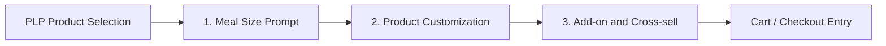

# Product Detail Page (PDP)

This page covers the post-PLP product decision flow.

After a customer selects an item from the PLP, the experience moves into the PDP sequence. In the current prototype, that sequence has three clear states.

The older `Format Options` label was too broad for the current prototype. This is better understood as a **Product Detail Page (PDP)** with extra steps inside the decision flow.

## Why This Step Is Designed This Way

The PDP is where browse intent turns into product commitment. Up to this point, the customer has been comparing categories and products at a relatively high level. Once they enter the PDP, the interface has to do something different: reduce uncertainty, make configuration feel manageable, and keep momentum toward basket creation.

This means the PDP should not behave like a single static product page. It should behave like a guided decision flow with the right amount of structure at each moment.

## PDP Flow At A Glance

In plain terms:

1. The customer selects a product from the PLP.
2. The flow asks how they want the meal configured.
3. The customer customizes the selected meal or product.
4. The experience offers add-ons or cross-sell items.
5. The customer continues toward basket confirmation and checkout.

## What The Design Is Doing

- It breaks a potentially complex product decision into smaller, more understandable steps.
- It front-loads the highest-impact decision first, so the customer understands the base meal format before editing details.
- It keeps the customer inside one continuous product flow instead of bouncing them between unrelated pages.
- It creates space for both customer confidence and commercial logic: configuration first, basket expansion second.

## Why The Design Works

### 1. It Improves Decision Clarity

The customer does not need every possible option at once. By separating meal size, customization, and add-on logic into distinct states, the experience becomes easier to understand and less mentally expensive to complete.

### 2. It Preserves Forward Momentum

Each state answers one clear question, then moves the customer onward. That is important because PDP friction often comes from making people feel like they are stuck in an endless configuration task. This sequence instead feels like visible progress.

### 3. It Supports Better Merchandising Without Confusion

The flow leaves room for commercial priorities, but at the right point in the journey. Size choice can increase value, customization can improve product fit, and cross-sell can increase basket size. Those opportunities work best when they appear in the right order rather than all at once.

### 4. It Keeps The Product Feel Intentional

Just like the Menu Landing page creates a stronger first browse moment, the PDP should create a stronger product decision moment. The structure should feel designed, not accidental. That means each state has a clear job and does not compete with the others.

## Screen Breakdown

Each stage below has its own dedicated page with its own screenshot and notes.

### 1. Meal Size Prompt

This is the first PDP state after product selection. It asks the customer how they want the meal configured before they move into deeper product editing.

- The customer is already inside a chosen product flow.
- The choice affects price, included items, and later customization states.
- The screen uses a focused modal pattern so the decision feels explicit and easy to compare.

[Open Meal Size Prompt page](/docs/frontend/customer-journey/preview-product-and-customize/product-detail)

### 2. Product Customization

After meal size is set, the customer moves into the main customization state.

- This is where modifiers, meal components, and item-specific choices are configured.
- The customer should feel like they are editing one selected product, not re-entering browse.
- Option grouping, defaults, and price clarity matter most here.

[Open Product Customization page](/docs/frontend/customer-journey/preview-product-and-customize/customize)

### 3. Add-on and Cross-sell

Once the core product is configured, the flow can present optional extension items.

- This appears after the customer has already shown strong purchase intent.
- It should feel like a helpful basket-building step, not a forced interruption.
- The customer should be able to accept or skip quickly and continue toward checkout.

[Open Add-on and Cross-sell page](/docs/frontend/customer-journey/preview-product-and-customize/add-on-and-cross-sell)

## Design Takeaway

The goal of this page is not just to show three separate screens. It is to explain how the PDP turns product interest into confident order-building. The strongest version of this flow keeps choices understandable, keeps the customer moving, and introduces commercial upsell moments only after the core decision is secure.

## Related Deep-Dive Pages

- [Meal Size Prompt](/docs/frontend/customer-journey/preview-product-and-customize/product-detail)
- [Product Customization](/docs/frontend/customer-journey/preview-product-and-customize/customize)
- [Add-on and Cross-sell](/docs/frontend/customer-journey/preview-product-and-customize/add-on-and-cross-sell)
