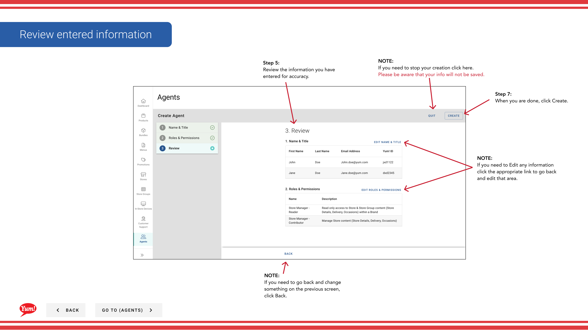

# Einen Agenten erstellen

## Was diese Anleitung deckt

Erstellt ein neues Benutzerkonto mit spezifischen Rollen und Berechtigungen, bietet Marktbetreibern oder Support-Mitarbeitern Zugriff auf das Byte Commerce Admin Portal.

## Schritte

**Step 1:** Navigieren Sie mit dem linken Navigationsmenü in den Abschnitt **Agents**.

**Step 2:** Klicken Sie auf die Schaltfläche **+ Neues Agent* erstellen.

**Step 3:** Füllen Sie die Agentendaten auf Seite 1. Mit * markierte Felder sind erforderlich.

| Feld | Eingeben | Anmerkungen |
|-------|--------------|-------|
| **Erste Name*** | Vorname des Agenten | z.B. „John“ |
| **Letzter Name*** | Nachname des Agenten | z.B. „Smith“ |
| **Email Adresse*** | Gültige E-Mail für Login und Benachrichtigungen | Muss einzigartig sein — keine zwei Agenten können die gleiche E-Mail haben. Für Passwortrückstellungen und Systemnachrichten verwendet. |
| ** Name*** | Anmeldungskennung | Muss nur Kleinbuchstaben sein — keine Leerzeichen, Nummern oder Sonderzeichen (z.B.`jsmith`, `john.smith`**Kann nicht nach der Schöpfung geändert werden.** |

:::caution
Bevor Sie einen neuen Agenten erstellen, suchen Sie nach First Name, Last Name, E-Mail Adresse oder Benutzername, um zu überprüfen, dass sie nicht bereits ein Konto haben.
:::

**Step 4:** Klicken Sie auf **Weiter**, um auf Seite 2 zu gehen — Roles & Permissions.

**Step 5:** Überprüfen Sie die verfügbaren Rollen und überprüfen Sie alle, die für diesen Agenten gelten. Rollen steuern, welche Abschnitte von Byte Portal der Agent zugreifen kann und welche Aktionen sie durchführen können.

| Laufsohle | Was es tut |
|------|-------------|
| **Menu Manager** | Kann Menüs erstellen, bearbeiten und veröffentlichen |
| ** Store Manager** | Kann Speichereinstellungen und Konfigurationen verwalten |
| **Promotionsmanager** | Kann Promotionen erstellen und verwalten |
| **Customer Support Agent** | Kann Bestellungen und Kunden suchen, Erstattungen ausstellen |
| ** System Administrator** | Voller Zugriff auf alle Byte Portal-Abschnitte |

:::tip
Verfügbare Rollen können je nach Organisation variieren. Überprüfen Sie die Boxen für jede Rolle, die dieser Agent benötigt.
:::

**Step 6:** Klicken Sie auf **Weiter**, um auf Seite 3 zu gehen — Bewertung.

**Step 7:** Überprüfen Sie alle eingegebenen Details für die Genauigkeit. Klicken Sie auf jeden blauen Abschnitt Header, um zurück zu springen und Korrekturen vorzunehmen.

**Step 8:** Klicken Sie auf **Kreate**, um das Agent-Konto abzuschließen.

:::tip
Nachdem Sie einen Agenten erstellt haben, können Sie auf **Add Another Agent** klicken, um zusätzliche Agenten zu erstellen, ohne in die Agentenliste zurückzukehren.
:::

:::caution
Klicken Sie auf **Cancel** zu jeder Zeit verworfen alle nicht gespeicherten Informationen.
:::

## Ähnliche Anleitungen

- [Einen Agenten bearbeiten](/docs/admin-portal-guide/agents/edit-an-agent/)

---

* Teil der[Admin Portal Guide](/docs/admin-portal-guide)· Abschnitt: Agenten*