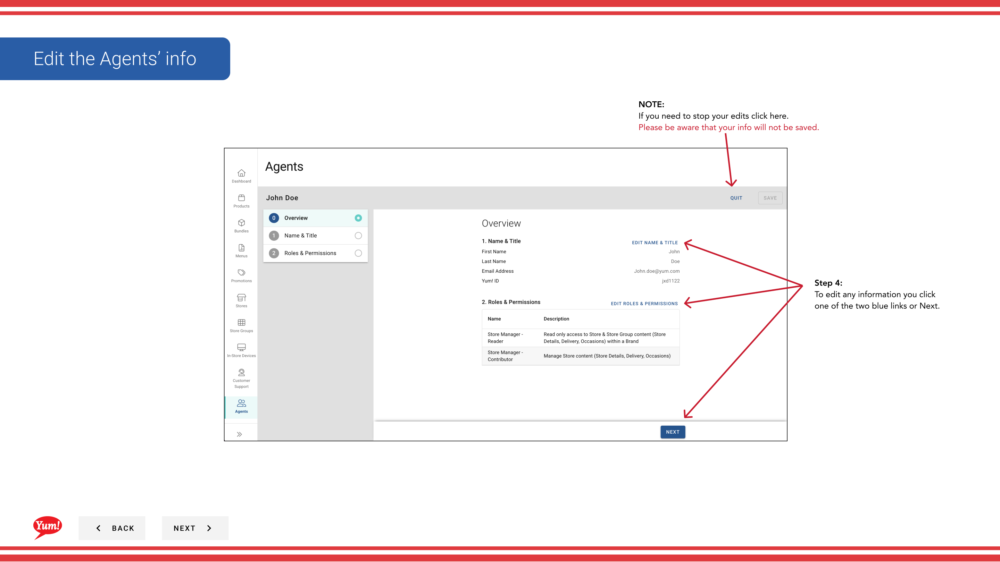

# Einen Agenten bearbeiten

## Was diese Anleitung deckt

Aktualisiert die Kontodetails, Rollen oder Zugriffsberechtigungen eines bestehenden Agenten.

## Schritte

**Step 1:** Navigieren Sie mit dem linken Navigationsmenü in den Abschnitt **Agents**.

**Step 2:** Suchen Sie nach dem Agenten, den Sie bearbeiten möchten. Sie können nach:
- Vorname
- Letzter Name
- Email Adresse
- Benutzername

Geben Sie eine dieser Details ein und die Liste wird filtern.

**Step 3:** Sobald Sie den Agenten finden, klicken Sie auf die Schaltfläche **** (Dreipunktmenü) in der gleichen Zeile, dann wählen Sie **Bearbeiten**.

**Step 4:** Das Bearbeitungsformular öffnet mit den gleichen Abschnitten wie die Agentenerstellung:
- **Agent Information** (Seite 1): Vorname, Nachname, E-Mail, Benutzername
- **Roles & Berechtigungen** (Seite 2): Rollen-Checkboxen
- **Review** (Seite 3): Zusammenfassung aller Änderungen

Klicken Sie auf blaue Abschnittsüberschriften, um zwischen den Seiten zu springen, oder klicken Sie auf **Next*, um sie sequentiell durchzuziehen.

**Step 5:** Machen Sie alle notwendigen Änderungen an den Details oder Rollen des Agenten. Sie können:
- Aktualisieren Sie Vorname, Nachname oder E-Mail-Adresse
- Rollen hinzufügen oder entfernen, indem Sie Kontroll- und Kontrollkästchen überprüfen
- **Note**: Benutzername kann nach der Erstellung nicht bearbeitet werden

**Step 6:** Sobald Sie alle Änderungen vorgenommen haben, klicken Sie auf **Save**, um sie zu verpflichten.

**Step 7:** Klicken Sie nach dem Speichern auf **Quit**, um den Edit-Bildschirm zu verlassen und in die Agents-Liste zurückzukehren.

:::tip
Die aktuellen Rollen und Berechtigungen des Agenten werden oben für eine schnelle Referenz angezeigt. Sie können alle Rollen entfernen, wenn nötig, aber Sie können kein Agent-Konto vollständig löschen — nur ihre Berechtigungen abstreifen.
:::

:::caution
Klicken Sie auf **Cancel** verworfen alle unerwünschten Änderungen.
:::

## Ähnliche Anleitungen

- [Einen Agenten erstellen](/docs/admin-portal-guide/agents/create-an-agent/)

---

* Teil der[Admin Portal Guide](/docs/admin-portal-guide)· Abschnitt: Agenten*