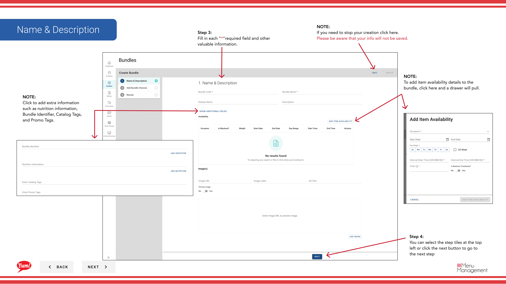

# Einen Bundle erstellen

## Was diese Anleitung deckt

Erstellt einen Combo- oder Mahlzeiten-Deal, indem er Produkte zusammen unter einem einzigen reinchasierbaren Element gruppiert, mit eigenem Code, Preis und Anzeigeinformationen.

## Schritte

**Step 1:** Navigieren Sie mit dem linken Navigationsmenü auf den Abschnitt **Bundles**.

**Step 2:** Klicken Sie auf die Schaltfläche **+ Neue Bundle** erstellen.

**Step 3:** Füllen Sie die Paketdetails auf Seite 1. Mit * markierte Felder sind erforderlich.

| Feld | Eingeben | Anmerkungen |
|-------|--------------|-------|
| **Bund Code*** | Kennung des Systems | Verwenden von Großbuchstaben, Zahlen und Bindestrichen — z.B.`BUNDLE-3PC-MEAL` |
| **Kleiner Name*** | Anzeigename für Kunden | z.B. "3-Piece Meal" |
| ** Name anzeigen** | Kürzere Etikette für limitierte Bildschirme | Defaults to Bundle Name wenn leer gelassen |
| **Beschreibung** | Beschreibung des Bündels nach Kundenwunsch | Halten Sie es attraktiv und klar |

:::tip
Klicken Sie auf die **Add Details* Schaltfläche (oder "..."), um optionale Informationen wie Nährwertinformationen, einen Bundle Identifier, Katalog Tags und Promo Tags hinzuzufügen.
:::

:::tip
Klicken Sie auf die **Item Availability** Schublade, um Verfügbarkeitsfenster (z.B. „Lunch 11am–3pm“) einzustellen, wenn dieses Paket geordnet werden soll.
:::

**Step 4:** Klicken Sie auf **Next** oder wählen Sie die nächste Schritt-Fliese oben, um auf Seite 2 zu gehen — Auswahl.

**Step 5:** Fügen Sie Optionen zu Ihrem Paket hinzu. Eine Wahl ist ein Auswahlschlitz (z.B. “Choose Your Side”).

- Um eine ** bestehende Auswahl** hinzuzufügen: Klicken Sie auf **Bestehende Auswahl** hinzufügen. Eine Suchschublade öffnet — Typ, um zu suchen und klicken Sie auf die Wahl, um sie auszuwählen, klicken Sie dann auf **Add**.
- Um eine ** neue Auswahl inline** zu erstellen: Klicken Sie **Neue Wahl*** und füllen Sie die Felder aus:

| Feld | Eingeben | Anmerkungen |
|-------|--------------|-------|
| **Choice Code*** | Kennung | z.B.,`CHOICE-SIDE` |
| **Choice Name*** | Kundenbeschriftung | z.B.: “Choose Your Side”, “Select Your Drink” |
| **Min. | Mindestauswahl erforderlich | Angepasst`0`zur Auswahl optional |
| ** Höchstmenge** | Maximale Auswahl möglich | z.B.,`1`für eine Auswahl |
| **Produkte** | Artikel innerhalb dieser Wahl | Suchen und Hinzufügen aus der Produktliste |

**Step 6:** Klicken Sie auf **Weiter**, um auf Seite 3 zu gehen — Bewertung.

**Step 7:** Überprüfen Sie alle eingegebenen Details. Klicken Sie auf jeden blauen Abschnitt Header, um zurück zu springen und Korrekturen vorzunehmen. Klicken Sie auf *****, um das Paket abzuschließen.

:::caution
Klicken Sie auf **Cancel** zu jeder Zeit verworfen alle nicht gespeicherten Informationen.
:::

## Ähnliche Anleitungen

- [Bild hinzufügen zu einem Bundle](/docs/admin-portal-guide/bundles/add-an-image-to-a-bundle/)
- [Einen Bundle bearbeiten](/docs/admin-portal-guide/bundles/edit-a-bundle/)
- [Einen Bundle kopieren](/docs/admin-portal-guide/bundles/copy-a-bundle/)

---

* Teil der[Admin Portal Guide](/docs/admin-portal-guide)· Sektion: Bundles*