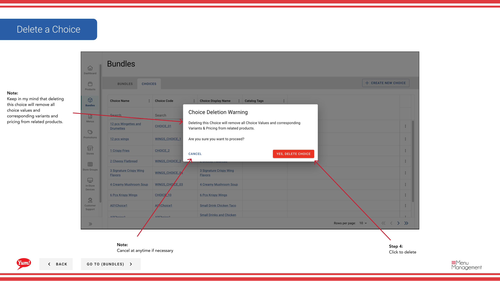

# Löschen einer Wahl

## Was diese Anleitung deckt

Entfernt eine Auswahl und ihre zugehörigen Produkte/Varianten aus dem System dauerhaft.

## Schritte

**Step 1:** Navigieren Sie mit dem linken Navigationsmenü auf den Abschnitt **Bundles**.

**Step 2:** Klicken Sie auf die Registerkarte **Choices* am oberen Rand des Bildschirms Bundles.

**Step 3:** Finden Sie die Wahl, die Sie löschen möchten, indem Sie durch die Suche nach Choice Name, Choice Code, Choice Display Name oder Katalog Tags.

**Step 4:** Klicken Sie auf die Schaltfläche **** (Dreipunktmenü) in der gleichen Zeile wie die Wahl, dann wählen Sie **Delete***.

**Step 5:** Es erscheint eine Bestätigungsmodalität. Klicken Sie auf **Bestätigen Sie*, um die Wahl zu löschen, oder klicken Sie außerhalb des Modal oder **Cancel**, um es zu halten.

:::caution
Diese Aktion ist dauerhaft. Löschen einer Wahl wird:
- Entfernen Sie es von allen Bündeln, die es verwenden
- Löschen Sie alle Auswahlwerte und entsprechende Varianten
- Entfernen Sie alle Preise, die mit dieser Wahl verbunden sind

Sie können diese Aktion nicht rückgängig machen. Bundles, die von dieser Wahl abhängig sind, funktionieren nicht mehr richtig, bis Sie eine Ersatzwahl hinzufügen.
:::

## Ähnliche Anleitungen

- [Eine Auswahl erstellen](/docs/admin-portal-guide/bundles/create-a-choice/)
- [Eine Wahl bearbeiten](/docs/admin-portal-guide/bundles/edit-a-choice/)
- [Eine Wahl kopieren](/docs/admin-portal-guide/bundles/copy-a-choice/)

---

* Teil der[Admin Portal Guide](/docs/admin-portal-guide)· Sektion: Bundles*