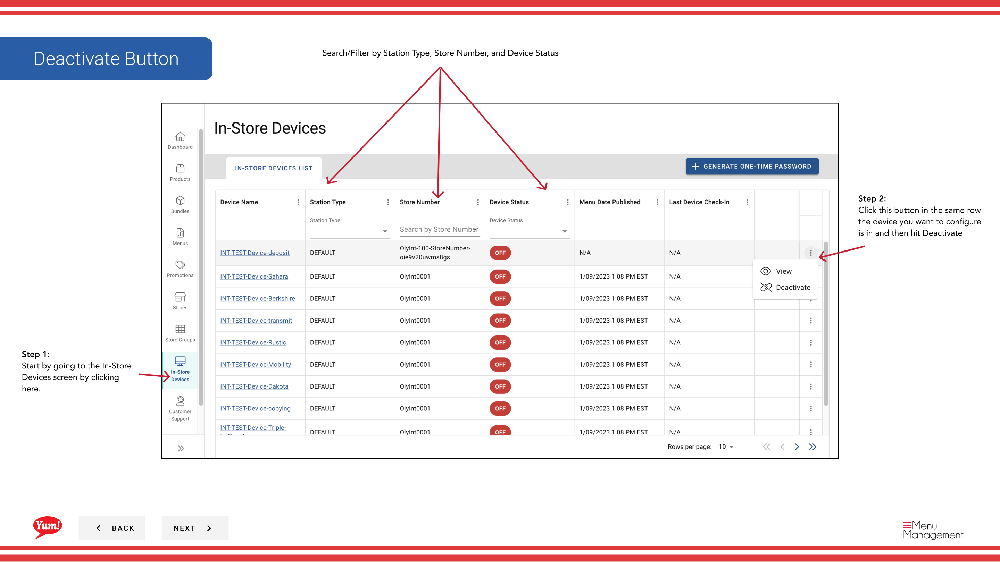

# In-Store deaktivieren

## Was diese Anleitung deckt

Deaktiviert ein POS-Terminal oder Kiosk vom Empfang von Menü-Updates und Bearbeitungsaufträgen. Diese Aktion ist reversibel - das Gerät kann jederzeit wieder aktiviert werden.

:::note Byte POS Caveat
Diese Anleitung geht davon aus, dass das Gerät im Rahmen einer **Byte POS**-Bereitstellung im Admin Portal verwaltet wird.

Wenn der Markt nicht Byte POS verwendet, muss **Byte Connect** Teil von Byte Commerce Onboarding sein, und die Betriebssteuerungen für den Markt POS können sich von dem hier gezeigten Gerätedeaktivierungsfluss unterscheiden.
:::

## Schritte

**Step 1:** Navigieren Sie mit dem linken Navigationsmenü in den Bereich **In-Store Devices**.

**Step 2:** Finden Sie das Gerät, das Sie deaktivieren möchten. Sie können nach Stationstyp, Speichernummer oder Gerätestatus suchen oder filtern.

**Step 3:** Klicken Sie auf die Schaltfläche **** (Dreipunktmenü) in der gleichen Zeile wie das Gerät, dann wählen Sie **Deaktivieren***.

**Step 4:** Eine Bestätigungsmodalität erscheint, wenn Sie die Deaktivierung bestätigen möchten. Überprüfen Sie den Gerätenamen, um sicherzustellen, dass Sie das richtige Gerät deaktivieren.

**Step 5:** Klicken Sie auf **Bestätigen**, um das Gerät zu deaktivieren. Das Gerät stoppt sofort Menü-Updates und kann Aufträge nicht bearbeiten. Klicken Sie auf **Cancel** oder klicken Sie außerhalb des Modal, um das Gerät aktiv zu halten.

:::caution
Das Deaktivieren eines Geräts verhindert das Empfangen von Menü-Updates und Bearbeitungsaufträgen, bis es wieder aktiviert ist. Kunden an diesem Standort können nicht bestellen.
:::

:::tip
Deaktivierung ist reversibel. Wenn Sie das Gerät später wieder aktivieren müssen, können Sie dies mit dem gleichen Menü tun. Sie müssen möglicherweise ein neues Einmal-Passwort generieren, um das Gerät neu zu authentifizieren.
:::

## Ähnliche Anleitungen

- [Ein-Zeit-Passwort generieren](/docs/admin-portal-guide/in-store-devices/generate-one-time-password/)
- [In-Store-Gerät Details anzeigen](/docs/admin-portal-guide/in-store-devices/view-in-store-device-details/)
- [Byte Connect](/docs/byte-capabilities/enablement/byte-connect)

---

* Teil der[Admin Portal Guide](/docs/admin-portal-guide)· Abschnitt: In-Store Geräte*
