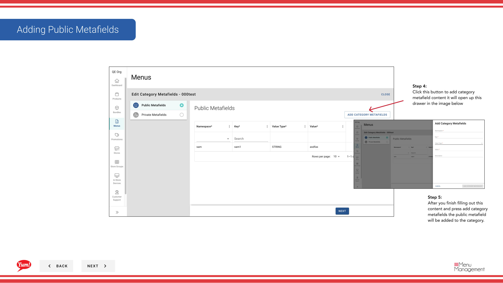

# Metafields zu einer Kategorie hinzufügen

## Was diese Anleitung deckt

Benutzerdefinierte Schlüsseldaten an eine Kategorie zur Integration mit externen Systemen oder marktspezifischen Anforderungen. Fügen Sie nur Metafelder hinzu, wenn Ihr technisches Team die benötigten Schlüssel und Werte angegeben hat.

## Schritte

**Step 1:** Navigieren Sie mit dem linken Navigationsmenü zum Abschnitt **Menus***.

**Step 2:** Klicken Sie auf den Ordner **Kategorien**, um alle Kategorien anzuzeigen.

**Step 3:** Suchen Sie die Kategorie, in der Sie Metafelder hinzufügen möchten, klicken Sie auf das **action-Menü* (drei Punkte) in der gleichen Zeile und wählen Sie **Meta***.

**Step 4:** Klicken Sie auf die **Add Metafield* Schaltfläche, um das Metafeld-Eintragsformular zu öffnen.

**Step 5:** Füllen Sie die Metafield-Details:

| Feld | Eingeben | Anmerkungen |
|-------|--------------|-------|
| **Key*** | Der Feldname nach Bedarf durch Ihre Integration | z.B.,`display_order`, `region`, `supplier_id`Fragen Sie Ihr technisches Team nach genauen Schlüsselnamen. |
| **Value*** | Der Datenwert für diesen Schlüssel | z.B.,`1`, `APAC`, `SUP-12345`. Muss mit dem von Ihrer Integration erwarteten Format übereinstimmen. |
| **Typ** | Öffentliche oder private | **Public**: Sichtbar auf externe Integrationen. **Private**: Nur für Ihr Team sichtbar. |

Klicken Sie ** Metafield* hinzufügen, um diesen Eintrag zu speichern.

**Step 6:** Um weitere Metafelder hinzuzufügen, wiederholen Sie **Step 4–5** für jedes benötigte Schlüsselwertpaar.

**Step 7:** Nachdem Sie alle benötigten Metafelder hinzugefügt haben, klicken Sie auf **** oder *****, um die Änderungen in der Kategorie zu bestätigen und anzuwenden.

:::caution
Fügen Sie nur Metafelder hinzu, wenn Ihr technisches Team die genauen Schlüssel und Werte angegeben hat. Falsche Metafelder können Integrationen brechen oder unerwartetes Verhalten verursachen.
:::

## Ähnliche Anleitungen

- [Kategorie bearbeiten](/docs/admin-portal-guide/menus/edit-a-category/)— Andere Kategorienangaben bearbeiten
- [Eine Kategorie erstellen](/docs/admin-portal-guide/menus/create-a-category/)— Neue Kategorie erstellen

---

* Teil der[Admin Portal Guide](/docs/admin-portal-guide)· Abschnitt: Menüs*