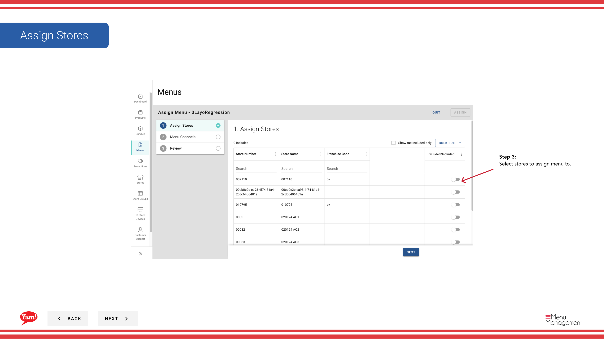

# Ein Menü zuordnen

## Was diese Anleitung deckt

Verlinkt ein Menü zu bestimmten Speichern und Bestellkanälen, so dass der richtige Katalog den Kunden dient.

## Schritte

**Step 1:** Navigieren Sie mit dem linken Navigationsmenü zum Abschnitt **Menus***.

**Step 2:** Finden Sie das Menü, das Sie in der Menüliste zuordnen möchten, klicken Sie auf das **Aktionsmenü* (drei Punkte) in der gleichen Zeile und wählen Sie **Assign***.

**Step 3:** Wählen Sie im Schritt **Stores* die Stores oder Store-Gruppen aus, die dieses Menü benutzen. Sie können suchen und filtern nach Gruppe, wenn nötig.

| Feld | Eingeben | Anmerkungen |
|-------|--------------|-------|
| **Stores*** | Wählen Sie einen oder mehrere Speicher | Verwenden Sie die Suche, um bestimmte Speicher zu finden, oder wählen Sie ganze Speichergruppen. Nur ausgewählte Stores erhalten dieses Menü. |

**Step 4:** Wählen Sie im Schritt **Channels**, welche Bestellkanäle dieses Menü an (z.B. Web, Mobile, Lieferplattformen) gebunden werden. Sie können mehrere Kanäle auswählen.

| Feld | Eingeben | Anmerkungen |
|-------|--------------|-------|
| * * * * * * * * * * * * * * * * * * * * * * * * * * * * * * * * * * * * * * * * * * * * * * * * * * * * * * * * * * * * * * * * * * * * * * * * * * * * * * * * * * * * * * * * * * * * * * * * * * * * * * * * * * * * * * * * * * * * * * * * * * * * * * * * * * * * * * * * * * * * * * * * * * * * * * * * * * * * * * * * * * * * * * * * * * * * * * * * * * * * * * * * * * * * * * * * * * * * * * * * * * * * * * * * * * * * * * * * * * * * * * * * * * * * * * * * * * * * * * * * * * * * * * * * * * * * * * * * | Wählen Sie einen oder mehrere Kanäle aus | Wählen Sie alle Kanäle, in denen Kunden dieses Menü sehen sollten. Das Menü wird nur auf ausgewählten Kanälen angezeigt. |

**Step 5:** Überprüfen Sie Ihre Auswahlen auf der Registerkarte **Summary**, um die Speicher und Kanäle zu bestätigen, klicken Sie dann auf **Assign**, um zu speichern.

:::tip
Das Menü wird nicht sofort in den Läden angezeigt. Sie müssen das Menü veröffentlichen, um es live auf den ausgewählten Kanälen zu machen.
:::

## Ähnliche Anleitungen

- [Menü veröffentlichen](/docs/admin-portal-guide/menus/publish-a-menu/)— Machen Sie das zugewiesene Menü live auf Bestellkanälen
- [Menü bearbeiten](/docs/admin-portal-guide/menus/edit-a-menu/)— Aktualisieren Sie das Menü, bevor Sie es den Läden zuweisen

---

* Teil der[Admin Portal Guide](/docs/admin-portal-guide)· Abschnitt: Menüs*