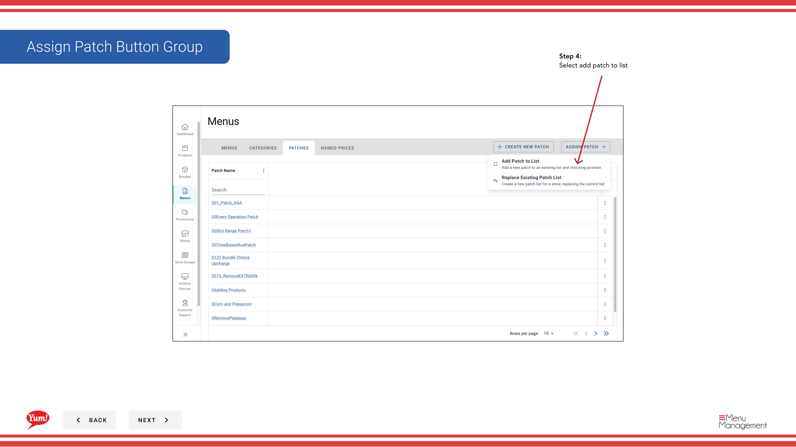

# Einen Patch zuordnen (Zu Patch hinzufügen)

## Was diese Anleitung deckt

Fügt einen Patch zur aktiven Patchliste eines Speichers hinzu, ohne vorhandene Patches zu entfernen. Patches werden in der Reihenfolge aufgetragen, wobei jedes Patch seine Overrides auf dem Basismenü und den vorherigen Patches schichtet.

## Schritte

**Step 1:** Navigieren Sie mit dem linken Navigationsmenü zum Abschnitt **Menus***.

**Step 2:** Klicken Sie auf die Registerkarte **Patches*, um alle Patches anzuzeigen.

**Step 3:** Klicken Sie auf die **Neue** Schaltfläche, um eine neue Patch-Zuordnung zu starten.

**Step 4:** Wählen Sie ** Patch in List* einfügen, um einen Patch in bestehende Patchlisten hinzuzufügen.

**Step 5:** Wählen Sie die **Patch** aus, die Sie aus dem Dropdown zuordnen möchten.

| Feld | Eingeben | Anmerkungen |
|-------|--------------|-------|
| **Patch*** | Wählen Sie aus der Liste der verfügbaren Patches | Wählen Sie den Patch mit den Overrides, die Sie anwenden möchten. |

**Step 6:** Wählen Sie die **Patch Position* in der Liste. Patches werden in der Reihenfolge angewendet, so Position zählt, wenn mehrere Patches die gleichen Elemente ansprechen.

| Feld | Eingeben | Anmerkungen |
|-------|--------------|-------|
| **Position*** | Wählen Sie aus, wo in der Patchliste dieser Patch hinzugefügt wird | "First" gilt dieses Patch vor anderen, "Letzte" gilt es danach. Wählen Sie basierend auf der Priorität Ihrer Overrides. |

**Step 7:** Wählen Sie das **Channel** aus, wo diese Patch-Zuordnung gilt.

| Feld | Eingeben | Anmerkungen |
|-------|--------------|-------|
| **Channel*** | Wählen Sie den Bestellkanal | z.B. "Web", "Mobil", "Delivery Platform". Der Patch wird nur auf dem ausgewählten Kanal angewendet. |

**Step 8:** Wählen Sie die **Stores** aus, die diesen Patch erhalten wird.

| Feld | Eingeben | Anmerkungen |
|-------|--------------|-------|
| **Stores*** | Wählen Sie einen oder mehrere Speicher | Verwenden Sie die Suche, um Geschäfte zu finden, oder wählen Sie ganze Speichergruppen. Nur ausgewählte Läden erhalten diesen Patch. |

**Step 9:** Überprüfen Sie Ihre Auswahlen auf der **Summary* Seite, klicken Sie dann auf **Save**, um den Patch in die ausgewählten Patchlisten der Stores hinzuzufügen.

:::tip
Der Patch wird nun der aktiven Patchliste des Stores hinzugefügt. Wenn der Speicher andere Patches hatte, wird dieser neue Patch zusätzlich zu ihnen basierend auf der gewählten Position hinzugefügt.
:::

## Ähnliche Anleitungen

- [Zuordnen eines Patches (Ersetzen vorhandene Liste)](/docs/admin-portal-guide/menus/assign-a-patch-replace-existing-list/)— Ersetzen Sie die gesamte Patchliste eines Speichers
- [Einen Patch bearbeiten](/docs/admin-portal-guide/menus/edit-a-patch/)— Aktualisieren Sie einen Patch, bevor Sie ihn zuweisen
- [Einen Patch erstellen](/docs/admin-portal-guide/menus/create-a-patch/)— Erstellen Sie einen neuen Patch zum Zuordnen

---

* Teil der[Admin Portal Guide](/docs/admin-portal-guide)· Abschnitt: Menüs*