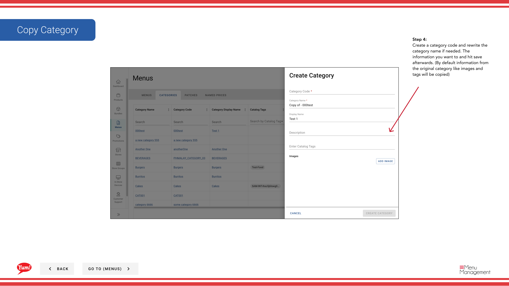

# Kategorie kopieren

## Was diese Anleitung deckt

Dupliziert eine bestehende Kategorie, um die Menüstrukturierung zu beschleunigen, ohne sie von Grund auf neu zu erstellen.

## Schritte

**Step 1:** Navigieren Sie mit dem linken Navigationsmenü zum Abschnitt **Menus***.

**Step 2:** Klicken Sie auf den Ordner **Kategorien**, um alle Kategorien anzuzeigen.

**Step 3:** Suchen Sie die Kategorie, die Sie kopieren möchten, klicken Sie in der gleichen Zeile auf das **Aktionsmenü* (drei Punkte) und wählen Sie **Copy***.

**Step 4:** Die Kategorie wird mit Feldern vorgefüllt aus dem Original erscheinen. Aktualisieren Sie die erforderlichen Felder:

| Feld | Eingeben | Anmerkungen |
|-------|--------------|-------|
| **Kategorie Code*** | Eine eindeutige Kennung für die neue Kategorie | Verwenden von Großbuchstaben und Bindestrichen — z.B.`CAT-CHICKEN-GRILLED`Es muss anders sein als das Original. Kann nach der Schöpfung nicht geändert werden. |
| **Kategorie Name** | Der Anzeigename für diese Kategorie | z.B. "Grilled Chicken". Ändern Sie bei Bedarf vom Original. Gezeigt auf Kunden im Menü. |
| ** Name anzeigen** | Optionaler alternativer Name | Abgelehnt von Original, kann aber aktualisiert werden. |
| **Beschreibung** | Optionale interne Anmerkungen | Abgelehnt von Original, kann aber aktualisiert werden. |
| ** Verfügbare Stunden** | Optionales Zeitfenster | Abgelehnt von Original, kann aber aktualisiert werden. |

Alle Konfigurationen aus der ursprünglichen Kategorie (Displayeinstellungen, Verfügbarkeitszeiten, Tags) werden automatisch kopiert.

**Step 5:** Klicken Sie auf *****, um die kopierte Kategorie zu speichern.

:::tip
Die kopierte Kategorie hat die gleiche Konfiguration wie das Original, aber mit einem neuen einzigartigen Kategoriecode. Sie können es nach der Erstellung weiter bearbeiten, wenn nötig.
:::

## Ähnliche Anleitungen

- [Kategorie bearbeiten](/docs/admin-portal-guide/menus/edit-a-category/)— Änderung der kopierten Kategorie
- [Eine Kategorie erstellen](/docs/admin-portal-guide/menus/create-a-category/)— Neue Kategorie von Grund auf erstellen
- [Kategorie löschen](/docs/admin-portal-guide/menus/delete-a-category/)— Kategorie entfernen

---

* Teil der[Admin Portal Guide](/docs/admin-portal-guide)· Abschnitt: Menüs*