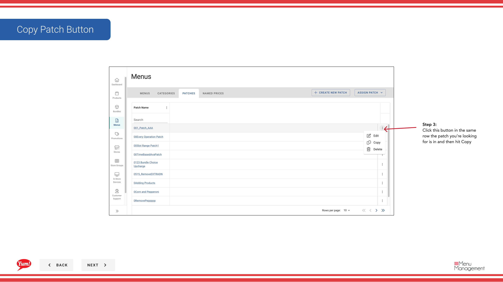
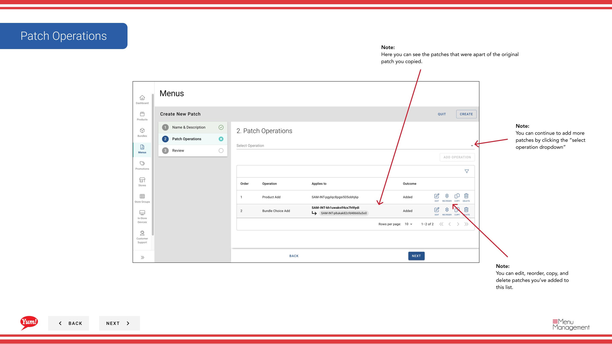

# Einen Patch kopieren

## Was diese Anleitung deckt

Dupliziert ein bestehendes Patch, um als Ausgangspunkt für ein ähnliches Set von Overrides zu verwenden.

## Schritte

**Step 1:** Navigieren Sie mit dem linken Navigationsmenü zum Abschnitt **Menus***.

**Step 2:** Klicken Sie auf die Registerkarte **Patches*, um alle Patches anzuzeigen.

**Step 3:** Finden Sie den Patch, den Sie kopieren möchten, klicken Sie in der gleichen Zeile auf das **Aktionsmenü* (drei Punkte) und wählen Sie **Copy***.

**Step 4:** Aktualisieren Sie den Patchnamen. Standardmäßig heißt das System es „Kopie des [originalen Patchnamens]“.

| Feld | Eingeben | Anmerkungen |
|-------|--------------|-------|
| **Papiername** | Ein beschreibender Name für diesen neuen Patch | z.B. "Sydney Q2 Pricing Override" (aus "Sydney Q1 Pricing Override"). Ändern Sie den Namen, um zu reflektieren, wofür dieser Patch verwendet wird. |

Alle Operationen und Elemente aus dem ursprünglichen Patch werden automatisch kopiert.

**Step 5:** Überprüfen Sie die kopierten Operationen, um sicherzustellen, dass sie Ihren Bedürfnissen entsprechen. Sie können Operationen vor dem Speichern bearbeiten, neu bestellen, hinzufügen oder löschen.

**Step 6:** Klicken Sie auf *****, um den kopierten Patch zu speichern.

:::tip
Der kopierte Patch ist unabhängig vom Original. Änderungen an einem Patch werden den anderen nicht beeinflussen. Bearbeiten Sie den kopierten Patch nach der Erstellung, wenn Sie die Operationen oder Elemente ändern müssen.
:::

## Ähnliche Anleitungen

- [Einen Patch bearbeiten](/docs/admin-portal-guide/menus/edit-a-patch/)— Ändern der Vorgänge des kopierten Patches
- [Löschen eines Patches](/docs/admin-portal-guide/menus/delete-a-patch/)— Entfernen eines Patches
- [Einen Patch zuordnen (Zu Patch hinzufügen)](/docs/admin-portal-guide/menus/assign-a-patch-add-to-patch-list/)— Diesen Patch zuordnen

---

* Teil der[Admin Portal Guide](/docs/admin-portal-guide)· Abschnitt: Menüs*