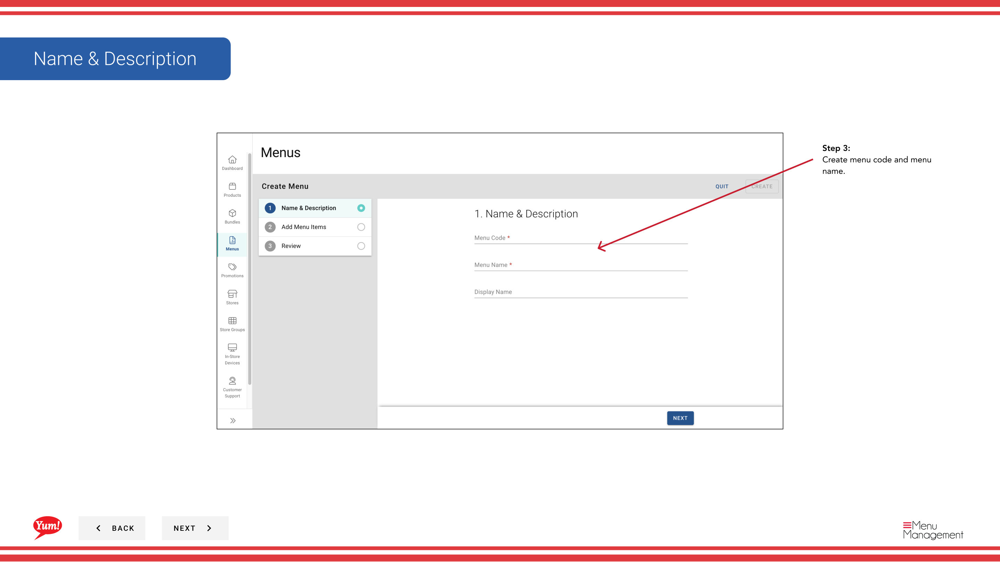
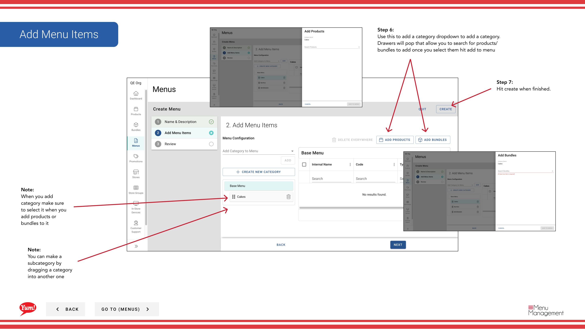

# Menü erstellen

## Was diese Anleitung deckt

Erstellt eine neue Menüstruktur in Atlas, die den Läden und Kanälen zugeordnet werden kann und definiert den Katalog der Produkte und Pakete zur Bestellung.

## Schritte

**Step 1:** Navigieren Sie mit dem linken Navigationsmenü zum Abschnitt **Menus***.

**Step 2:** Klicken Sie auf die Schaltfläche **Neues Menü** erstellen.

**Step 3:** Füllen Sie die Menüdaten aus. Mit * markierte Felder sind erforderlich.

| Feld | Eingeben | Anmerkungen |
|-------|--------------|-------|
| **Menu Code*** | Eine eindeutige Kennung für dieses Menü | Nur Großbuchstaben, Zahlen und Bindestriche verwenden — z.B.`AU-BREAKFAST-2024`. Kann nach der Schöpfung nicht geändert werden. |
| **Menu Name*** | Ein human lesbarer Name für dieses Menü | z.B. "Australia Frühstück Menu 2024". In der Menüliste angezeigt und angezeigt, wenn Sie Menüs zu den Läden zuordnen. |

**Step 4:** Fügen Sie Kategorien zu Ihrem Menü hinzu, indem Sie auf den ** Kategorie hinzufügen* Dropdown klicken und aus der Liste auswählen. Sie können mehrere Kategorien hinzufügen.

:::tip
Um eine geschachtelte Unterkategorie zu erstellen, ziehen Sie eine Kategorie in eine andere Kategorie im Menübauer. Die geschleppte Kategorie wird unter dem Ziel geschachtelt.
:::

**Step 5:** Sobald Sie Ihre Kategorien hinzugefügt haben, klicken Sie auf den ** Produkte/Bundles* Dropdown in jeder Kategorie, um es mit Elementen zu bevölkern. Eine Schublade wird geöffnet — Suche nach Artikeln und klicken Sie auf **Zu Menu** hinzufügen.

**Step 6:** Klicken Sie auf **Kreate**, um das Menü zu speichern.

:::caution
Klicken Sie auf **Cancel** zu jeder Zeit verworfen alle ungewollten Änderungen.
:::

## Ähnliche Anleitungen

- [Ein Menü zuordnen](/docs/admin-portal-guide/menus/assign-a-menu/)— Verknüpfen Sie dieses Menü an Läden und Kanäle
- [Menü veröffentlichen](/docs/admin-portal-guide/menus/publish-a-menu/)— Schieben Sie das Menü, um die Bestellkanäle zu leben
- [Eine Kategorie erstellen](/docs/admin-portal-guide/menus/create-a-category/)— Erstellen Sie benutzerdefinierte Kategorien zu Ihrem Menü hinzufügen

---

* Teil der[Admin Portal Guide](/docs/admin-portal-guide)· Abschnitt: Menüs*