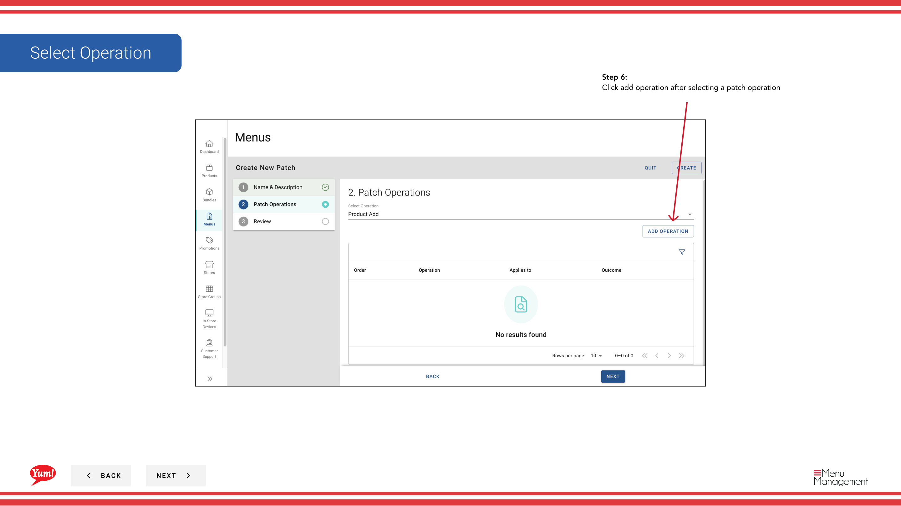

# Einen Patch erstellen

## Was diese Anleitung deckt

Erstellt ein Menü-Patch – ein gezieltes Überschreiben, das bestimmte Elemente (Produkte, Pakete oder Varianten) in einem Menü verändert, ohne das gesamte Menü zu ersetzen. Gemeinsam für lokalisierte Preise oder regionale Verfügbarkeitsänderungen verwendet.

## Schritte

**Step 1:** Navigieren Sie mit dem linken Navigationsmenü zum Abschnitt **Menus***.

**Step 2:** Klicken Sie auf die Registerkarte **Patches*, um alle Patches anzuzeigen.

**Step 3:** Klicken Sie auf die Schaltfläche **Neuer Patch** erstellen.

**Step 4:** Geben Sie einen beschreibenden Namen für den Patch ein. Mit * markierte Felder sind erforderlich.

| Feld | Eingeben | Anmerkungen |
|-------|--------------|-------|
| **Papiername*** | Ein beschreibender Name für das, was dieser Patch ändert | z.B. „Sydney Q1 Pricing Override“, „Halalal Menu Availability Fix“, „Regional Promo Discount“. Wird verwendet, um den Patch in Listen zu identifizieren. |

**Step 5:** Wählen Sie aus dem Dropdown eine **Operation** aus. Dies definiert die Art der Änderung, die das Patch macht.

| Betrieb | Zweck |
|-----------|---------|
| Preis Override | Änderung des Preises für bestimmte Artikel |
| Verfügbarkeit Override | Artikel zu bestimmten Zeiten aktivieren oder deaktivieren |
| Artikel aktivieren/verschieden | Artikel ein- oder ausschalten |
| Andere benutzerdefinierte Operationen | Abhängig von Ihrem Systemaufbau |

**Step 6:** Nach der Auswahl einer Operation klicken Sie auf ** Operation hinzufügen*, um fortzufahren.

**Step 7:** Suchen Sie nach und wählen Sie die spezifischen Produkte, Varianten oder Bündel, auf die diese Operation gilt. Sobald Sie alle benötigten Elemente ausgewählt haben, klicken Sie auf ** Operation hinzufügen**, um sie zu speichern.

**Step 8:** Sie können weitere Operationen zum gleichen Patch hinzufügen, indem Sie **Steps 5–7** wiederholen. Jede Operation ermöglicht die Bündelung von zusammenhängenden Änderungen zusammen.

**Step 9:** Sobald Sie alle Operationen hinzugefügt haben, klicken Sie auf **Kreate**, um den Patch zu speichern.

:::tip
Sie können mehrere Operationen zu einem einzelnen Patch hinzufügen, um zusammenhängende Änderungen zu bündeln. Zum Beispiel können Sie einen Patch erstellen, der sowohl Preisüberschreitungen als auch Verfügbarkeitsänderungen für eine regionale Förderung beinhaltet.
:::

:::tip
Patches werden noch nicht auf Läden angewendet. Nach der Erstellung eines Patches müssen Sie es den Läden mit den Anleitungen „Assign a Patch“ zuordnen.
:::

## Ähnliche Anleitungen

- [Einen Patch bearbeiten](/docs/admin-portal-guide/menus/edit-a-patch/)— Aktualisieren der Operationen oder Elemente eines Patches
- [Einen Patch kopieren](/docs/admin-portal-guide/menus/copy-a-patch/)— Vervielfältigen eines Patches als Ausgangspunkt
- [Einen Patch zuordnen (Zu Patch hinzufügen)](/docs/admin-portal-guide/menus/assign-a-patch-add-to-patch-list/)— Fügen Sie diesen Patch in die aktive Liste eines Speichers hinzu
- [Löschen eines Patches](/docs/admin-portal-guide/menus/delete-a-patch/)— Entfernen eines Patches

---

* Teil der[Admin Portal Guide](/docs/admin-portal-guide)· Abschnitt: Menüs*