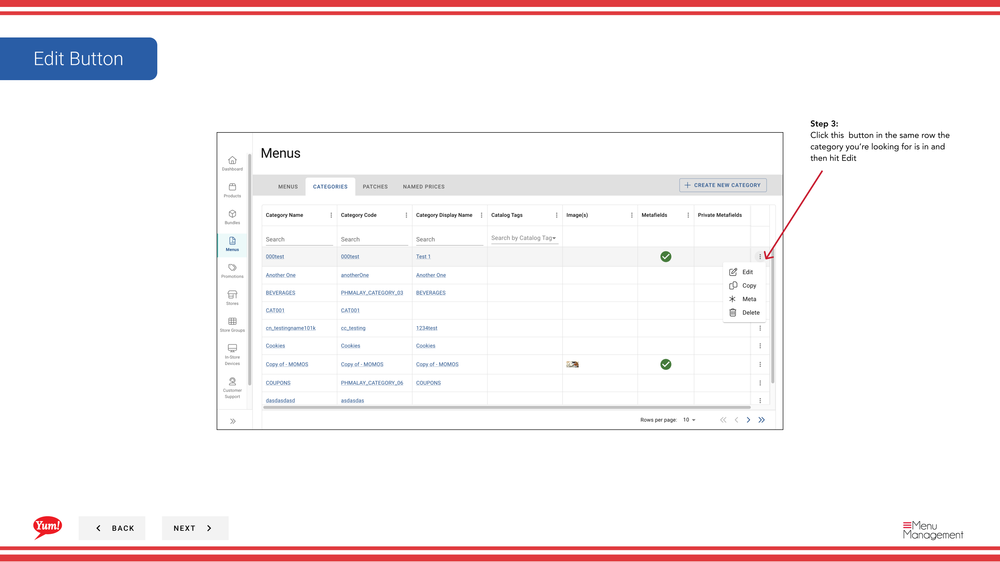
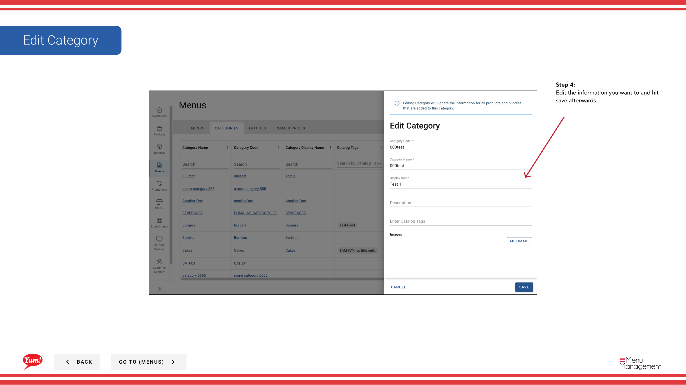

# Kategorie bearbeiten

## Was diese Anleitung deckt

Aktualisiert den Namen, die Einstellungen oder die Konfiguration einer Kategorie.

## Schritte

**Step 1:** Navigieren Sie mit dem linken Navigationsmenü zum Abschnitt **Menus***.

**Step 2:** Klicken Sie auf den Ordner **Kategorien**, um alle Kategorien anzuzeigen.

**Step 3:** Suchen Sie die Kategorie, die Sie bearbeiten möchten, klicken Sie auf das **action Menü* (drei Punkte) in der gleichen Zeile und wählen Sie **Bearbeiten**.

**Step 4:** Aktualisieren Sie alle folgenden Felder:

| Feld | Eingeben | Anmerkungen |
|-------|--------------|-------|
| **Kategorie Name** | Der Anzeigename für diese Kategorie | z.B. "Chicken", "Sides", "Desserts". Veränderungen werden für Kunden sichtbar sein. |
| ** Name anzeigen** | Optionaler alternativer Name für bestimmte Kanäle | Verwenden Sie auf bestimmten Plattformen ein kürzeres Etikett. Blättern Sie leer, um den Kategorienamen zu verwenden. |
| **Beschreibung** | Optionale interne Anmerkungen zu dieser Kategorie | Nur für Ihr Team sichtbar – nicht für Kunden. |
| ** Verfügbare Stunden** | Optionales Zeitfenster für diese Kategorie | Beschränkung der Verfügbarkeit auf bestimmte Stunden — z.B. "6:00 Uhr - 11:00 Uhr". Lassen Sie leer für die tägliche Verfügbarkeit. |

**Step 5:** Sobald Sie Ihre Änderungen vorgenommen haben, klicken Sie auf **Save**, um sie anzuwenden.

:::tip
Der Kategoriecode kann nicht bearbeitet werden — es ist permanent und für Systemintegrationen verwendet werden. Änderungen des Kategorienamens und der Verfügbarkeit wirken sich dann aus, wenn das Menü aufgehoben wird.
:::

## Ähnliche Anleitungen

- [Eine Kategorie erstellen](/docs/admin-portal-guide/menus/create-a-category/)— Neue Kategorie erstellen
- [Kategorie löschen](/docs/admin-portal-guide/menus/delete-a-category/)— Kategorie entfernen
- [Metafields zu einer Kategorie hinzufügen](/docs/admin-portal-guide/menus/add-metafields-to-a-category/)— Benutzerdefinierte Daten dieser Kategorie anhängen

---

* Teil der[Admin Portal Guide](/docs/admin-portal-guide)· Abschnitt: Menüs*