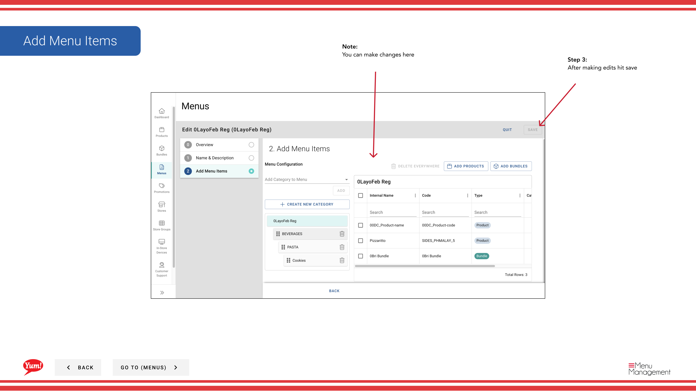

# Menü bearbeiten

## Was diese Anleitung deckt

Aktualisiert die Konfiguration eines vorhandenen Menüs, wie seinen Namen, zugewiesene Elemente oder Kategoriestruktur.

## Schritte

**Step 1:** Navigieren Sie mit dem linken Navigationsmenü zum Abschnitt **Menus***.

**Step 2:** Finden Sie das Menü, das Sie in der Menüliste bearbeiten möchten, klicken Sie in der gleichen Zeile auf das **action Menü* (drei Punkte) und wählen Sie **Bearbeiten**.

**Step 3:** Auf der Registerkarte Übersicht können Sie die folgenden Felder anzeigen oder ändern:

| Feld | Eingeben | Anmerkungen |
|-------|--------------|-------|
| **Menu Name** | Ein human lesbarer Name für dieses Menü | z.B. "Australia Frühstück Menu 2024". Gezeigt in der Menüliste und bei der Zuordnung von Menüs zu Läden. |
| **Menu Code** | Die eindeutige Systemkennung | Anzeige nur — kann nach der Schöpfung nicht geändert werden. |

**Step 4:** Kategorien hinzufügen oder entfernen, indem Sie die **Add Kategorie** Dropdown verwenden oder Kategorien verschieben, um sie neu zu bestellen. Um eine Kategorie zu entfernen, klicken Sie auf das **remove*-Symbol neben ihm.

**Step 5:** Bearbeiten Sie Kategorieinhalte, indem Sie jede Kategorie erweitern und den ** Produkte/Bundles* Dropdown verwenden, um Elemente hinzuzufügen oder zu entfernen.

**Step 6:** Sobald Sie alle Änderungen vorgenommen haben, klicken Sie auf **Save**, um sie anzuwenden.

:::tip
Alle Änderungen werden in dieser Menüversion gespeichert. Sie werden nicht in den Läden erscheinen, es sei denn, das Menü wird zurückgegeben und wiederveröffentlicht.
:::

## Ähnliche Anleitungen

- [Menü veröffentlichen](/docs/admin-portal-guide/menus/publish-a-menu/)— Menüänderungen in Live-Kanälen veröffentlichen
- [Ein Menü zuordnen](/docs/admin-portal-guide/menus/assign-a-menu/)— Dieses Menü den Läden und Kanälen zuordnen
- [Menü kopieren](/docs/admin-portal-guide/menus/copy-a-menu/)— Duplizieren Sie dieses Menü, um eine neue Version zu erstellen

---

* Teil der[Admin Portal Guide](/docs/admin-portal-guide)· Abschnitt: Menüs*