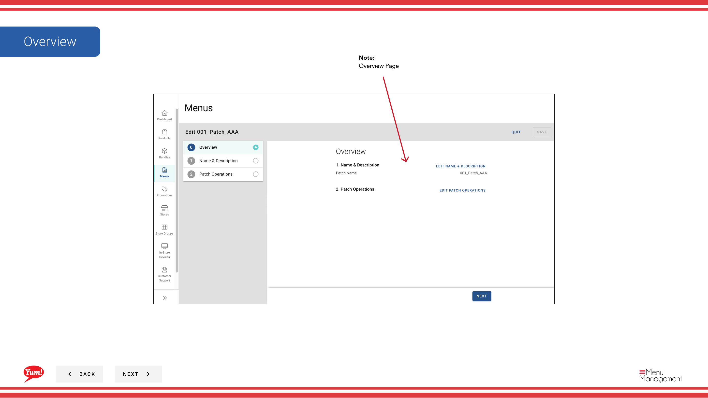

# Einen Patch bearbeiten

## Was diese Anleitung deckt

Aktualisiert den Namen, die Operationen oder die Elemente eines vorhandenen Patches.

## Schritte

**Step 1:** Navigieren Sie mit dem linken Navigationsmenü zum Abschnitt **Menus***.

**Step 2:** Klicken Sie auf die Registerkarte **Patches*, um alle Patches anzuzeigen.

**Step 3:** Finden Sie den Patch, den Sie bearbeiten möchten, klicken Sie in der gleichen Zeile auf das **action-Menü* (drei Punkte) und wählen Sie **Bearbeiten***.

**Step 4:** Auf der Registerkarte Übersicht können Sie den Patchnamen aktualisieren.

| Feld | Eingeben | Anmerkungen |
|-------|--------------|-------|
| **Papiername** | Ein beschreibender Name für das, was dieser Patch ändert | z.B. „Sydney Q1 Pricing Override“, „Halalal Menu Availability Fix“. Aktualisieren, ob sich der Umfang oder der Zweck geändert hat. |

**Step 5:** Die Operationen im Abschnitt **Operations** ansehen und ändern. Sie können:
- Bearbeiten Sie eine Operation, indem Sie sie anklicken und die Elemente oder Einstellungen aktualisieren
- Reord-Operationen durch Ziehen
- Kopieren einer Operation
- Löschen einer Operation
- Fügen Sie neue Operationen hinzu, indem Sie auf **

**Step 6:** Sobald Sie alle Änderungen vorgenommen haben, klicken Sie auf **Save**, um sie anzuwenden.

:::tip
Änderungen an einem Patch betreffen nur Stores, in denen es aktiv zugewiesen wird. Patches, die noch nicht zugewiesen oder aus der Patchliste eines Speichers entfernt wurden, werden nicht betroffen sein.
:::

## Ähnliche Anleitungen

- [Einen Patch kopieren](/docs/admin-portal-guide/menus/copy-a-patch/)— Duplizieren Sie diesen Patch
- [Löschen eines Patches](/docs/admin-portal-guide/menus/delete-a-patch/)— Entfernen Sie diesen Patch
- [Einen Patch zuordnen (Zu Patch hinzufügen)](/docs/admin-portal-guide/menus/assign-a-patch-add-to-patch-list/)— Diesen Patch zuordnen

---

* Teil der[Admin Portal Guide](/docs/admin-portal-guide)· Abschnitt: Menüs*