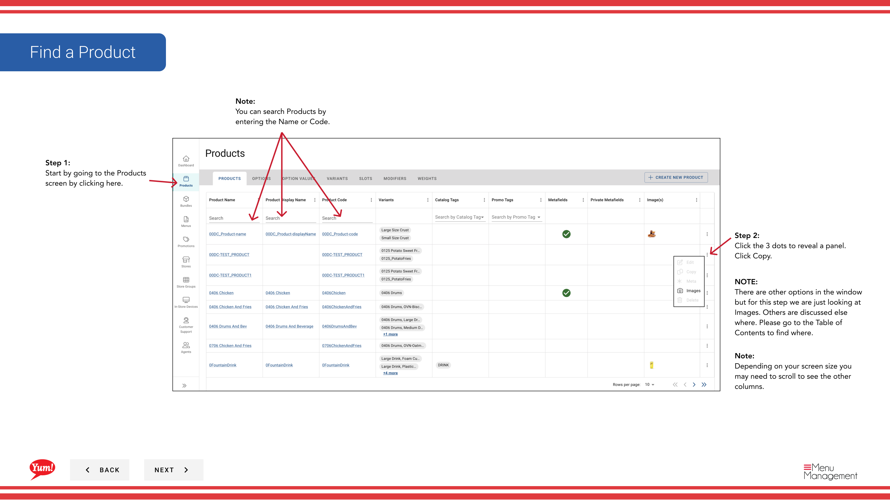

# Fügen Sie ein Bild zu einem Produkt hinzu

## Was diese Anleitung deckt

Laden Sie Bilder hoch und ordnet sie einem Produkt zu, so dass die Kunden bei der Bestellung über digitale Kanäle genaue Visualisierungen sehen.

## Schritte

**Step 1:** Navigieren Sie mit dem linken Navigationsmenü in den Abschnitt **Produkte**.

**Step 2:** Finden Sie das Produkt, das Sie ein Bild hinzufügen möchten. Sie können nach Produktname oder Produktcode suchen.

**Step 3:** Klicken Sie auf das Dreipunktmenü neben dem Produktnamen, dann wählen Sie **Bearbeiten**.

**Step 4:** Klicken Sie im Bearbeitungsformular auf den Bildbereich oder klicken Sie auf **Weiter**, um ihn zu erreichen. Suchen Sie nach dem **Images* Bereich.

**Step 5:** Klicken Sie auf ** Bild hinzufügen** oder den Upload-Bereich, um eine Bilddatei von Ihrem Computer auszuwählen.

**Step 6:** Füllen Sie die Bilddetails:

| Feld | Eingeben | Anmerkungen |
|-------|--------------|-------|
| **Image Upload** | Klicken Sie auf eine Bilddatei | JPG, PNG und WebP-Formate werden unterstützt |
| **Primärbild** | Toggle to **Yes** wenn das Hauptbild angezeigt wird | Nur ein Bild pro Produkt sollte als primär markiert werden |

**Step 7:** Wenn Sie mehrere Bilder hinzufügen müssen, klicken Sie auf **Weiteres Bild hinzufügen** und wiederholen Sie die Schritte 5-6.

**Step 8:** Wenn Sie fertig sind, klicken Sie auf die **Save** Taste.

## Anmerkungen

:::tip
Toggle **Primary Image*******, um dies als Hauptbild für Kunden zu definieren.
:::

:::tip
Sie können mehrere Bilder zu einem Produkt hinzufügen, indem Sie auf **Ein weiteres Bild hinzufügen**.
:::

:::caution
Klicken Sie auf **Cancel** verworfen alle unerwünschten Bild-Additionen.
:::

---

* Teil der[Admin Portal Guide](/docs/admin-portal-guide)· Abschnitt: Produkte*