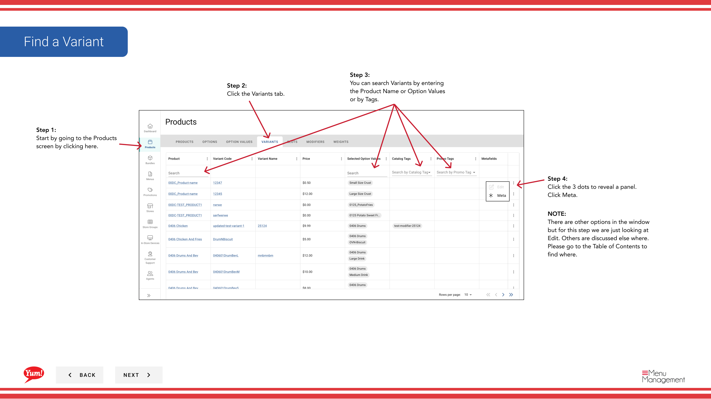
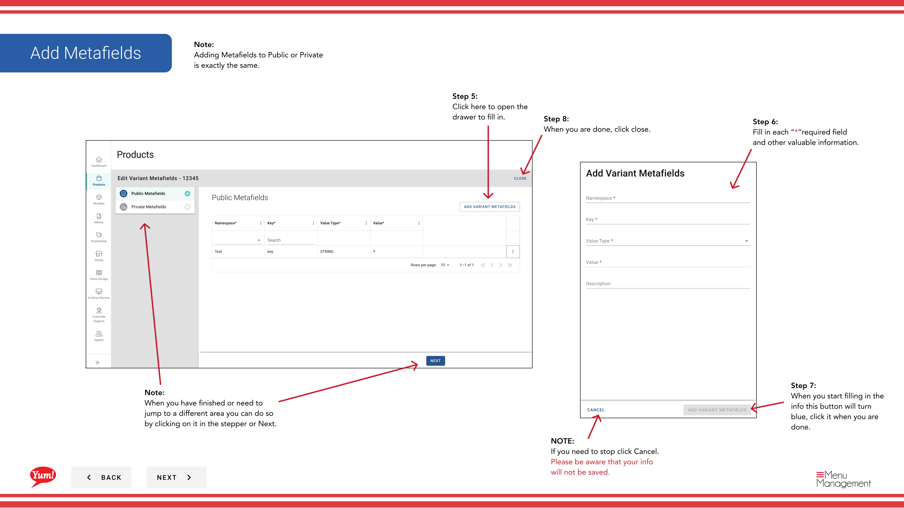
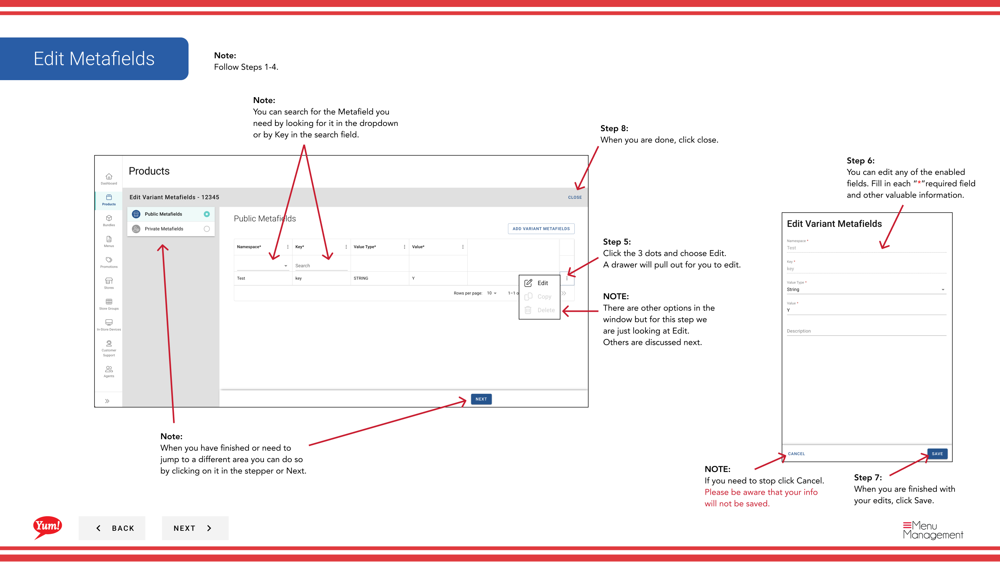
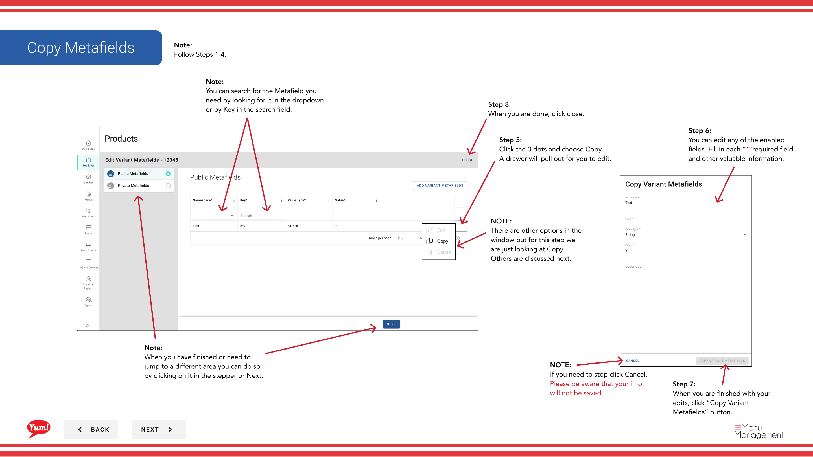

# Metafelder zu einer Variante hinzufügen

## Was diese Anleitung deckt

Befestigt marktspezifische strukturierte Daten an eine Produktvariante zur Systemintegration oder nachgelagerten Anforderungen.

## Schritte

**Step 1:** Navigieren Sie mit dem linken Navigationsmenü in den Abschnitt **Produkte**.

**Step 2:** Klicken Sie auf die Registerkarte **Variants**.

**Step 3:** Suchen Sie nach der Variante, indem Sie den Produktnamen, Optionswerte oder Tags im Suchfeld eingeben.

**Step 4:** Klicken Sie auf das Dreipunktmenü neben der Variante, dann wählen Sie **Meta***.

**Step 5:** Eine Schublade wird sowohl **Public** als auch **Private*** Metafeldabschnitte öffnen.

**Step 6:** Klicken Sie auf die Schaltfläche ****, um ein neues Metafeld hinzuzufügen.

**Step 7:** Füllen Sie jedes Metafeld mit dem genauen Schlüssel und Wert, den Ihr technisches Team spezifiziert hat.

### Um ein bestehendes Metafield zu bearbeiten

**Step 8:** Klicken Sie auf das Dreipunkt-Menü neben dem Metafeld, das Sie bearbeiten möchten, und wählen Sie dann **Bearbeiten**.

**Step 9:** Aktualisieren Sie den Schlüssel und den gewünschten Wert, klicken Sie dann auf **Save***.

### Um ein Metafield zu kopieren

**Step 10:** Klicken Sie auf das Dreipunkt-Menü neben dem Metafeld, das Sie kopieren möchten, und wählen Sie dann **Copy**.

**Step 11:** Ein neuer Metafield-Eintrag wird mit demselben Schlüssel und Wert erstellt. Bearbeiten, wenn nötig.

### Um ein Metafield zu löschen

**Step 12:** Klicken Sie auf das Dreipunkt-Menü neben dem Metafeld, das Sie löschen möchten, und wählen Sie dann **Delete***.

**Step 13:** Klicken Sie auf die rote **Delete** Schaltfläche, um das Metafeld dauerhaft zu entfernen.

**Step 14:** Wenn Sie fertig sind, klicken Sie auf **Close**, um die Schublade zu schließen.

## Anmerkungen

:::caution
Fügen Sie nur Metafelder hinzu, wenn Ihr technisches Team die genauen Schlüssel und Werte angegeben hat. Falsche Metafelder können zu Integrationsstörungen führen.
:::

:::tip
Sie können nach Metafeldern suchen, indem Sie im Dropdown suchen oder den Schlüsselnamen im Suchfeld eingeben.
:::

:::tip
Das Hinzufügen von Metafeldern zu **Public* oder **Private*** folgt dem gleichen Verfahren.
:::

:::caution
Das Löschen eines Metafelds ist permanent. Bestätigen Sie, dass Sie den korrekten Eintrag entfernen, bevor Sie auf Löschen klicken.
:::

---

* Teil der[Admin Portal Guide](/docs/admin-portal-guide)· Abschnitt: Produkte*