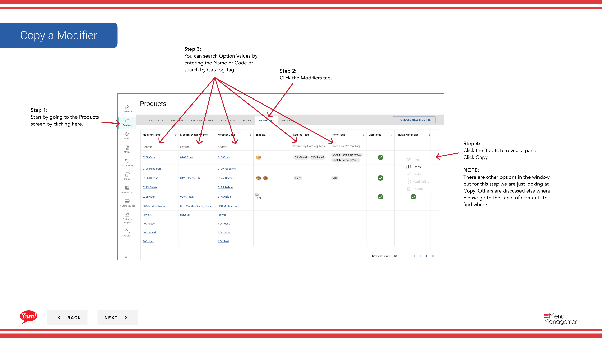

# Kopieren eines Modifiers

## Was diese Anleitung deckt

Dupliziert einen Modifikator, um ähnliche Add-ons schnell zu bauen, ohne alle Informationen erneut einzugeben.

## Schritte

**Step 1:** Navigieren Sie mit dem linken Navigationsmenü in den Abschnitt **Produkte**.

**Step 2:** Klicken Sie auf die Registerkarte **Modifiers**.

**Step 3:** Suchen Sie nach dem Modifier, den Sie kopieren möchten, indem Sie den Namen, den Code oder den Katalog Tag im Suchfeld eingeben.

**Step 4:** Klicken Sie auf das Dreipunkt-Menü neben dem Modifier, dann wählen Sie **Kopieren**.

**Step 5:** Das Kopierformular erscheint mit den Informationen des ursprünglichen Modifiers. Aktualisieren Sie die Felder nach Bedarf. Mit * markierte Felder sind erforderlich.

| Feld | Eingeben | Anmerkungen |
|-------|--------------|-------|
| **Modifier Code*** | Einzigartige Kennung für den neuen Modifier | Muss anders sein als das Original (z.B. „MOD-EXTRA-CHEESE-COPY“) |
| **Modifier Name*** | Name für Kunden | Kann gleich oder angepasst sein |
| **Preis** | Zusätzliche Ladung für diesen Modifier | Geben Sie`0`wenn es keinen Aufpreis gibt |
| **Image** | Optionales Bild für diesen Modifier | Toggle **Primary Image** nach Ja bei Bedarf. Klicken Sie auf **Ein weiteres Bild hinzufügen*, um mehr hinzuzufügen. |

**Step 6:** Wenn Sie die Bearbeitung abgeschlossen haben, klicken Sie auf die Schaltfläche **Create Modifier**.

## Anmerkungen

:::caution
Der **Modifier Code** muss einzigartig sein. Sie können den gleichen Code wie der ursprüngliche Modifikator nicht verwenden.
:::

:::tip
Sie können Modifikatoren nach Name, Code oder Katalog Tag suchen.
:::

:::caution
Klicken Sie auf **Cancel** verworfen alle unerwünschten Änderungen.
:::

---

* Teil der[Admin Portal Guide](/docs/admin-portal-guide)· Abschnitt: Produkte*