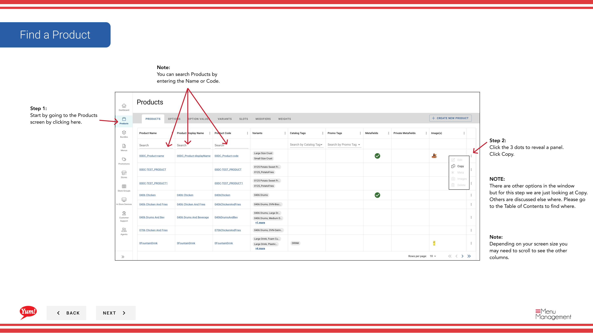

# Produkt kopieren

## Was diese Anleitung deckt

Dupliziert ein bestehendes Produkt als Ausgangspunkt und reduziert die Dateneingabe bei der Erstellung ähnlicher Artikel im Katalog.

## Schritte

**Step 1:** Navigieren Sie mit dem linken Navigationsmenü in den Abschnitt **Produkte**.

**Step 2:** Finden Sie das Produkt, das Sie kopieren möchten. Sie können nach Produktname oder Produktcode suchen.

**Step 3:** Klicken Sie auf das Dreipunkt-Menü neben dem Produktnamen, dann wählen Sie **Kopieren**.

**Step 4:** Das Kopierformular erscheint mit den meisten der bereits eingefüllten Informationen des Originalprodukts. Ändern Sie alle Felder nach Bedarf.

**Step 5:** Folgen Sie den gleichen Schritten wie die Erstellung eines neuen Produkts. Gehen Sie durch jede Seite (Basic Information, Optionen, Varianten, Slots, Bulk Actions, Tags, Review) indem Sie auf **Next** klicken oder direkt auf einen Abschnitt springen, indem Sie auf seinen blauen Header klicken.

**Step 6:** Wenn Sie Ihre Änderungen abgeschlossen haben, klicken Sie auf die **Kreate** Taste. Die Schaltfläche wird nur nach Änderungen anklickbar sein.

## Anmerkungen

:::tip
Sie können Produkte nach Produktname oder Produktcode suchen, um schnell den Artikel zu finden, den Sie kopieren möchten.
:::

:::tip
Klicken Sie auf den blauen Abschnittskopf, um direkt auf den Abschnitt zu springen, den Sie ändern möchten, anstatt Schritt für Schritt zu navigieren.
:::

:::caution
Klicken Sie auf **Cancel** verworfen alle unerwünschten Änderungen.
:::

---

* Teil der[Admin Portal Guide](/docs/admin-portal-guide)· Abschnitt: Produkte*