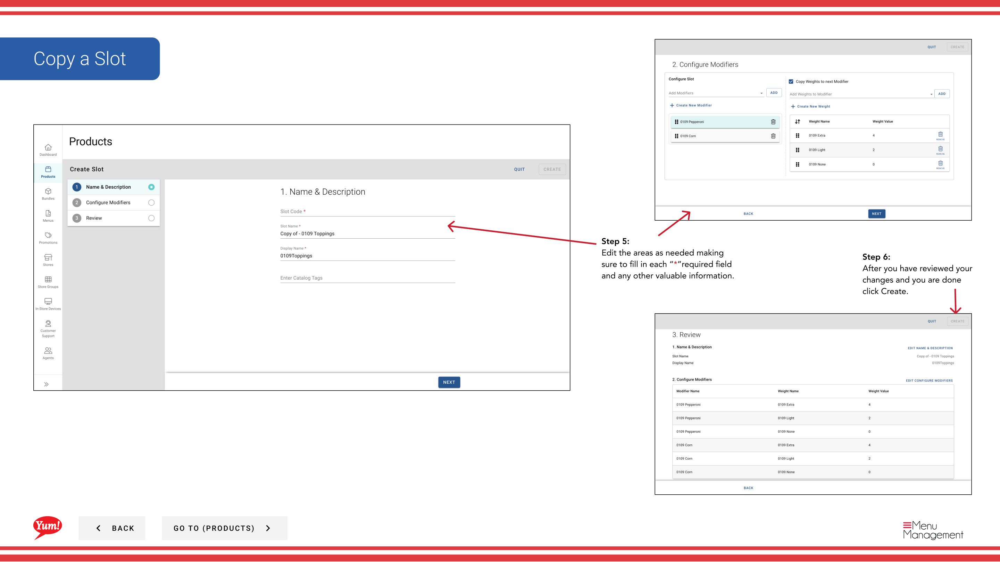

# Kopieren Sie einen Slot

## Was diese Anleitung deckt

Dupliziert einen Slot, um die Produktkonfiguration bei der Erstellung ähnlicher Anpassungsstrukturen zu beschleunigen.

## Schritte

**Step 1:** Navigieren Sie mit dem linken Navigationsmenü in den Abschnitt **Produkte**.

**Step 2:** Klicken Sie auf die Registerkarte **Slots**.

**Step 3:** Suchen Sie nach dem Slot, den Sie kopieren möchten, indem Sie den Slot Name, Slot Code oder Tag im Suchfeld eingeben.

**Step 4:** Klicken Sie auf das Dreipunktmenü neben dem Slot, dann wählen Sie **Kopieren**.

**Step 5:** Das Kopierformular wird mit den Informationen des ursprünglichen Slot angezeigt. Aktualisieren Sie die Felder nach Bedarf. Mit * markierte Felder sind erforderlich.

| Feld | Eingeben | Anmerkungen |
|-------|--------------|-------|
| **Slot Code*** | Einzigartige Kennung für den neuen Slot | Muss anders als das Original sein |
| **Slot Name*** | Beschreibt, was Anpassung dieser Slot bietet | Kann gleich oder angepasst sein |
| **Min. | Mindest-Modifier-Auswahl erforderlich | 0 = optional |
| ** Höchstmenge** | Maximale Modifier-Auswahl erlaubt | Blättern Sie leer für unbegrenzt |

**Step 6:** Überprüfen Sie alle Abschnitte (Basic Information, Modifiers, Gewichte) und machen Sie alle notwendigen Änderungen.

**Step 7:** Wenn Sie Ihre Änderungen überprüft haben und bereit sind, klicken Sie auf **Kreate**.

## Anmerkungen

:::caution
Der **Slot Code** muss einzigartig sein. Sie können den gleichen Code wie der ursprüngliche Slot nicht verwenden.
:::

:::tip
Sie können Slots nach Slot Name, Slot Code oder Tag suchen, um schnell den Artikel zu finden, den Sie kopieren möchten.
:::

:::caution
Klicken Sie auf **Cancel** verworfen alle unerwünschten Änderungen.
:::

---

* Teil der[Admin Portal Guide](/docs/admin-portal-guide)· Abschnitt: Produkte*