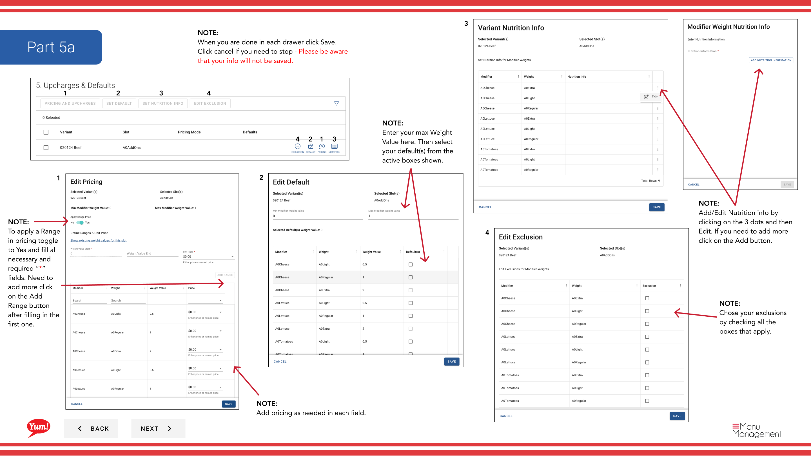
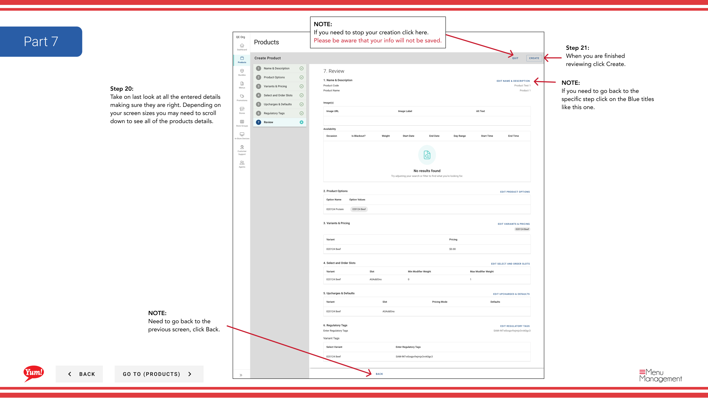

# Produkt erstellen

## Was diese Anleitung deckt

Erstellt ein komplettes Produkt von Grund auf, definiert seinen Code, Namen, Varianten, Optionen, Preise, Slots, Modifier und Verfügbarkeit Fenster, so dass es bereit ist, über digitale Kanäle zu verkaufen.

## Schritte

### Seite 1: Basic Product Information

**Step 1:** Navigieren Sie mit dem linken Navigationsmenü in den Abschnitt **Produkte**.

**Step 2:** Klicken Sie auf die Schaltfläche **+ Neues Produkt erstellen**.

**Step 3:** Füllen Sie die Produktdetails. Mit * markierte Felder sind erforderlich.

| Feld | Eingeben | Anmerkungen |
|-------|--------------|-------|
| ** Produktcode*** | Einzigartige Systemkennung für dieses Produkt | Verwenden Sie Großbuchstaben, Zahlen und Bindestriche (z.B. „ZINGER-BURGER“). Kann nach der Schöpfung nicht geändert werden. |
| ** Produktname*** | Voller Anzeigename für Kunden | z.B. „Zinger Burger“ |
| ** Name anzeigen** | Kurzer Name für begrenzten Bildschirmraum | Defaults to Product Name wenn leer gelassen |
| **Beschreibung** | Produktbeschreibung für Kunden | Halten Sie es klar und Appetit |
| **Ihre Verfügbarkeit** | Wenn dieses Produkt zur Bestellung verfügbar ist | Klicken Sie, um eine Schublade zu öffnen und Zeitfenster einzustellen (z.B. „Breakfast“ 6am–11am). Lassen Sie leer für die tägliche Verfügbarkeit. |
| **Tags** | Optionale Etiketten für Berichterstattung und Filterung | Geben Sie ein oder wählen Sie aus Dropdown |

**Step 4:** Klicken Sie auf **Weiter**, um auf die Optionsseite zu gelangen.

### Seite 2: Optionen

**Step 5:** Fügen Sie Anpassungsgruppen hinzu (z.B. „Größe“, „Spice Level“), aus denen Kunden bei der Bestellung wählen können.

| Feld | Eingeben | Anmerkungen |
|-------|--------------|-------|
| ** Optionen* | Anpassungsgruppen für dieses Produkt | Wählen Sie bestehende Optionen aus dem Dropdown aus. Wenn die gewünschte Option nicht existiert, klicken Sie auf **Neue Option erstellen*. |

**Step 6:** Um Optionen neu zu bestellen, klicken Sie auf und ziehen Sie den sechs-dot Drag-Handgriff, um sie in der Reihenfolge zu arrangieren Sie möchten, dass Kunden sie sehen.

**Step 7:** Um eine Option zu entfernen, klicken Sie neben dem Optionsnamen auf **X**.

**Step 8:** Klicken Sie auf **Weiter**, um zur Seite Variants zu gelangen.

### Seite 3: Varianten

**Step 9:** Definieren Sie jede wählbare Kombination von Optionen (z.B. „Zinger Burger - Regular“).

**Step 10:** Klicken Sie für jede Variante im Feld **Variant Code**, um das Editierfeld zu öffnen, geben Sie einen eindeutigen Code ein (z.B. "ZINGER-REGULAR"), klicken Sie dann auf **Save****. Klicken **Cancel** wird den Code verwerfen.

**Step 11:** Um eine Standardvariante einzustellen, die Kunden zuerst sehen, klicken Sie auf **Standardvariante** Dropdown und wählen Sie die Variante aus.

**Step 12:** Um Varianten neu zu bestellen, klicken Sie auf und ziehen Sie den Sechspunkt-Zuggriff.

**Step 13:** Um eine Variante zu löschen, klicken Sie auf das Dreipunktmenü neben der Variante und wählen Sie **Delete**.

**Step 14:** Klicken Sie auf **Next**, um auf die Ablageseite zu gelangen.

### Seite 4: Ablagefächer

**Step 15:** Fügen Sie Slots (Positionen, in denen Modifier platziert werden können, z.B. "Sauce Selection", "Cheese Options") hinzu.

**Step 16:** Wählen Sie Varianten (individuell oder alle), um Slots auf sie anzuwenden.

**Step 17:** Klicken Sie auf **Apply Bulk Slots**, um die gleichen Slots zu mehreren ausgewählten Varianten auf einmal hinzuzufügen. Oder klicken Sie auf **Bearbeiten** auf einer bestimmten Variante, um Slots nur dieser Variante hinzuzufügen.

**Step 18:** Wählen Sie Ihre Slots aus dem Dropdown aus und klicken Sie auf **Add**.

**Step 19:** Klicken Sie *****, wenn Sie fertig sind.

**Step 20:** Klicken Sie auf **Weiter**, um zur Seite Bulk Actions zu gelangen.

### Seite 5: Bulk Actions

**Step 21:** Fügen Sie Preise, Gewichte, Ernährung oder Ausschlüsse zu Varianten in Bulk.

**Step 22:** Wählen Sie Varianten (individuell oder alle).

**Step 23:** Klicken Sie auf einen dieser Bulk-Action-Tasten, um sich auf alle ausgewählten Varianten zu bewerben:
- **Add Pricing**: Geben Sie den Preis für jede Variante ein. Um einen Preisbereich zu verwenden, schalten Sie **Range*** nach Ja und füllen Sie min/max Werte aus.
- ** Gewichte hinzufügen*: Geben Sie den maximalen Gewichtswert ein und wählen Sie Standardgewicht(e).
- **Add Nutrition**: Klicken Sie auf das Dreipunktmenü > **Bearbeiten*, um Nährinformationen hinzuzufügen.
- ** Ausschlüsse hinzufügen*: Überprüfen Sie alle Allergene oder Diätausschluss-Boxen, die gelten.

**Step 24:** Klicken Sie **** in jeder Schublade, wenn Sie fertig sind, oder **Cancel**, um Änderungen zu verwerfen.

**Step 25:** Klicken Sie auf **Weiter**, um auf die Seite Tags zu gelangen.

### Seite 6: Variant Tags

**Step 26:** Fügen Sie optionale Tags zu Varianten zur Berichterstattung und Filterung hinzu.

**Step 27:** Klicken Sie auf ****, um die gewünschten Felder zu enthüllen. Wählen Sie aus dem ersten Dropdown einen **Variant** aus, geben Sie dann einen Tagwert aus dem zweiten Feld ein oder wählen Sie aus.

**Step 28:** Klicken Sie **** erneut, um weitere Tags bei Bedarf hinzuzufügen.

**Step 29:** Klicken Sie auf **Weiter**, um auf die Seite "Bewertung" zu gelangen.

### Seite 7: Bewertung

**Step 30:** Überprüfen Sie alle eingegebenen Details, um sicherzustellen, dass sie korrekt sind. Verwenden Sie die blauen Teilköpfe, um wieder auf eine bestimmte Seite zu springen und Korrekturen bei Bedarf vorzunehmen.

**Step 31:** Wenn Sie zufrieden sind, klicken Sie auf die Schaltfläche ****, um das Produkt zu speichern.

## Anmerkungen

:::caution
Klicken Sie auf **Cancel** bei jedem Schritt verwerfen Sie alle nicht gespeicherten Informationen.
:::

:::tip
Sie können direkt auf jede Seite springen, indem Sie auf den blauen Abschnitt Header klicken, anstatt auf **Next** mehrmals.
:::

:::tip
Wenn Sie mehr als ein Bild hinzufügen müssen, können Sie dies auf der Variante bearbeiten Bildschirm nach der Erstellung tun.
:::

:::tip
Wenn Sie nicht die Option sehen, die Sie im Dropdown benötigen, klicken Sie auf **Neue Option erstellen*, um sie zuerst zu erstellen.
:::

:::tip
Sie können Drag &amp; Drop-Optionen und Varianten mit den sechs-dot Drag Griffe, um sie neu zu bestellen.
:::

---

* Teil der[Admin Portal Guide](/docs/admin-portal-guide)· Abschnitt: Produkte*