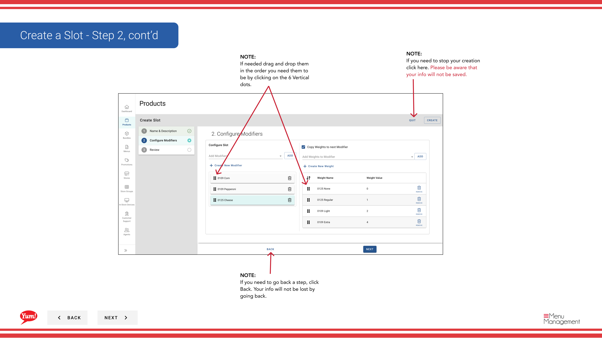

# Erstellen Sie einen Slot

## Was diese Anleitung deckt

Erstellt eine Position innerhalb eines Produkts, in dem Modifikatoren platziert werden können (z.B. "Sauce Selection", "Cheese Options"), strukturiert, wie Add-ons Kunden präsentiert werden.

## Schritte

### Schritt 1: Basic Slot Information

**Step 1:** Navigieren Sie mit dem linken Navigationsmenü in den Abschnitt **Produkte**.

**Step 2:** Klicken Sie auf die Registerkarte **Slots**.

**Step 3:** Klicken Sie auf die **+ Neue Slot**-Taste erstellen.

**Step 4:** Füllen Sie die Slot-Details. Mit * markierte Felder sind erforderlich.

| Feld | Eingeben | Anmerkungen |
|-------|--------------|-------|
| **Slot Code*** | Einzigartige Kennung für diesen Slot | Verwenden Sie Großbuchstaben, Zahlen und Bindestriche (z.B. „SLOT-SAUCE“) |
| **Slot Name*** | Beschreibt, was Anpassung dieser Slot bietet | z.B. „Sauce Selection“, „Cheese Optionen“ |
| **Min. | Mindestanzahl an Modularwahlen erforderlich | 0 = optional |
| ** Höchstmenge** | Maximale Anzahl von Modifier-Auswahlen erlaubt | Blättern Sie leer für unbegrenzt |

**Step 5:** Wenn Sie fertig sind, klicken Sie auf **Weiter*, um auf die Seite Modifiers zu gehen.

### Schritt 2: Modifier hinzufügen

**Step 6:** Wählen Sie alle Modifikatoren aus, die für diesen Slot benötigt werden, und klicken Sie dann auf **Add** für jeden einzelnen.

**Step 7:** Wenn Sie den Modifier nicht sehen, den Sie benötigen, klicken Sie auf **Neuer Modifier**, um ihn zuerst zu erstellen.

**Step 8:** Um Modifikatoren neu zu bestellen, klicken Sie auf und ziehen Sie den sechs-dot Drag Griff.

**Step 9:** Klicken Sie auf **Weiter**, um auf die Seite Gewichte zu gehen.

### Schritt 3: Gewicht hinzufügen

**Step 10:** Wählen Sie Gewichtsoptionen (Teilgrößen) für jeden Modifikator aus dem Dropdown, dann klicken Sie **Add**.

**Step 11:** Wenn mehrere Modifikatoren die gleichen Gewichte teilen, überprüfen Sie die **Apply an alle* Box, um diese Gewichte auf einmal allen Modifikatoren zuzuordnen.

**Step 12:** Um Gewichte neu zu bestellen, klicken Sie auf und ziehen Sie den sechs-dot Drag Griff.

**Step 13:** Klicken Sie auf *****, um den Slot zu speichern.

## Anmerkungen

:::caution
Klicken Sie auf **Cancel** verwerfen alle nicht gespeicherten Informationen.
:::

:::tip
Wenn Sie keinen Modifier sehen, den Sie benötigen, klicken Sie auf **Neue Modifier**, um sie vor dem Weiterfahren hinzuzufügen.
:::

:::tip
Sie können Modifikatoren und Gewichte mit den sechs-dotigen Drag Griffen neu bestellen.
:::

:::tip
Verwenden Sie **Apply an alle**, um die gleichen Gewichte auf einmal mehreren Modifikatoren zuzuordnen.
:::

:::tip
Sie können zurück zu vorherigen Schritten gehen, indem Sie auf **Back*** klicken, ohne Informationen zu verlieren.
:::

---

* Teil der[Admin Portal Guide](/docs/admin-portal-guide)· Abschnitt: Produkte*