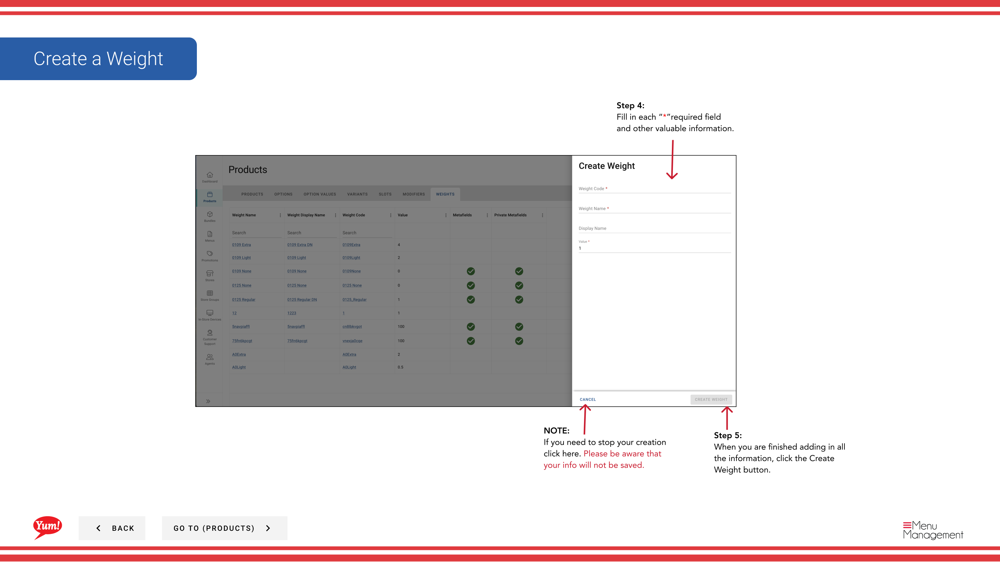

# Erstellen Sie ein Gewicht

## Was diese Anleitung deckt

Definiert eine Gewichts- oder Portionsgrößen-Konfiguration für ein Produkt, das in Märkten verwendet wird, in denen Produkte nachverfolgt oder nach Gewicht preiswert bewertet werden.

## Schritte

**Step 1:** Navigieren Sie mit dem linken Navigationsmenü in den Abschnitt **Produkte**.

**Step 2:** Klicken Sie auf die Registerkarte **Weights**.

**Step 3:** Klicken Sie auf die Schaltfläche **+ Neues Gewicht** erstellen.

**Step 4:** Füllen Sie die Gewichtsangaben. Mit * markierte Felder sind erforderlich.

| Feld | Eingeben | Anmerkungen |
|-------|--------------|-------|
| **Weight Code*** | Einzigartige Kennung für dieses Gewicht | Verwenden Sie Großbuchstaben, Zahlen und Bindestriche (z.B. „WT-REGULAR“) |
| **Weight Name*** | Beschreibt die Portionsgröße | z.B. „Regular“, „Large“, „Double“ |
| **Max Gewicht** | numerischer Maximalgewichtswert | z.B. „500“ (in Gramm oder in Ihrer Einheit) |
| **Standard** | Sich als Standard markieren | Nur ein Gewicht sollte als Standard pro Option markiert werden |

**Step 5:** Wenn Sie fertig sind, alle Informationen hinzuzufügen, klicken Sie auf die **Kreate Gewicht** Taste.

## Anmerkungen

:::caution
Klicken Sie auf **Cancel** verwerfen alle nicht gespeicherten Informationen.
:::

:::tip
Der **Weight Code** muss einzigartig sein und nach der Schöpfung nicht verändert werden.
:::

:::tip
Toggle **Default*** auf Ja, um dies für Kunden die vorgewählte Gewichtsoption zu machen.
:::

---

* Teil der[Admin Portal Guide](/docs/admin-portal-guide)· Abschnitt: Produkte*