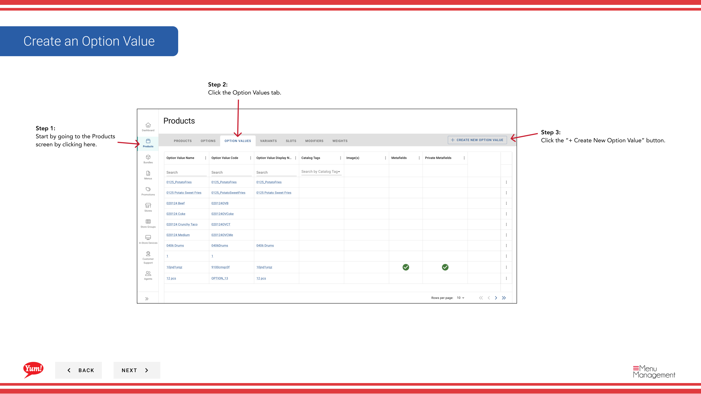

# Erstellen eines Optionswerts

## Was diese Anleitung deckt

Fügt eine individuelle Wahl innerhalb einer Optionsgruppe hinzu (z.B. „Large“ unter „Größe“), so dass Kunden während der Bestellung wählbare Artikel erhalten.

## Schritte

**Step 1:** Navigieren Sie mit dem linken Navigationsmenü in den Abschnitt **Produkte**.

**Step 2:** Klicken Sie auf die Registerkarte **Optionswerte**.

**Step 3:** Klicken Sie auf die Schaltfläche **+ Neue Optionswert** erstellen.

**Step 4:** Füllen Sie die Option Wertdetails. Mit * markierte Felder sind erforderlich.

| Feld | Eingeben | Anmerkungen |
|-------|--------------|-------|
| **Optionswertcode*** | Einzigartige Kennung für diese Wahl | Verwenden Sie Großbuchstaben, Zahlen und Bindestriche (z.B. „SIZE-LG“) |
| **Optionswert Name*** | Die Auswahl an Kunden | z.B. „Large“, „Originalrezept“, „Hot & Spicy“ |
| ** Name anzeigen** | Kürzeres Etikett für begrenzten Bildschirmraum | Defaults to Option Value Name wenn leer gelassen |
| **Image** | Optionales Bild für diese Wahl | Toggle **Primary Image** auf Ja, wenn dies das Hauptbild ist. Klicken Sie auf **Ein weiteres Bild hinzufügen*, um mehr hinzuzufügen. |

**Step 5:** Wenn Sie fertig sind, alle Informationen hinzuzufügen, klicken Sie auf die Schaltfläche ** Wählen Sie den Wert***.

## Anmerkungen

:::caution
Klicken Sie auf **Cancel** verwerfen alle nicht gespeicherten Informationen.
:::

:::tip
Toggle **Primary Image*******, um dieses Bild als Hauptbild für diesen Optionswert einzustellen.
:::

:::tip
Sie können mehrere Bilder hinzufügen, indem Sie auf **Ein weiteres Bild hinzufügen**.
:::

---

* Teil der[Admin Portal Guide](/docs/admin-portal-guide)· Abschnitt: Produkte*