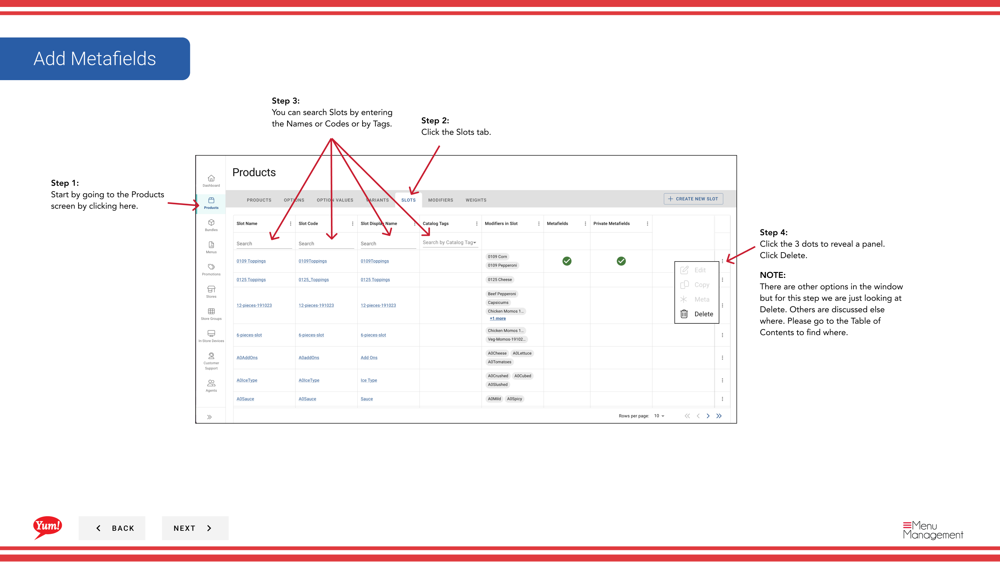
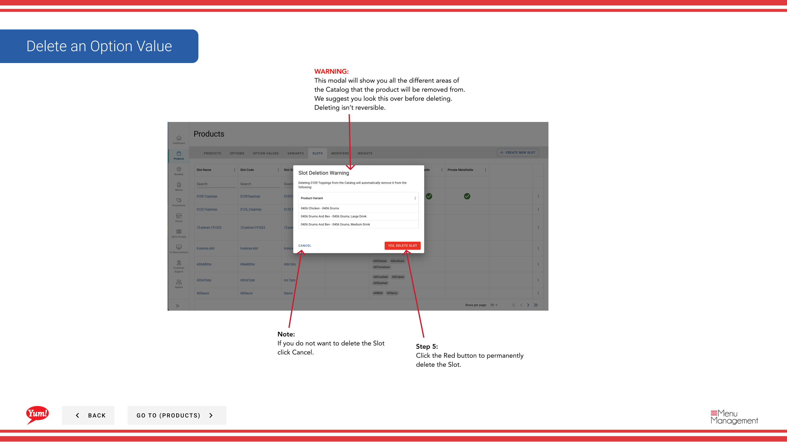

# Löschen eines Slot

## Was diese Anleitung deckt

Entfernt einen Schlitz vom System, wenn die Konfiguration nicht mehr benötigt wird.

## Schritte

**Step 1:** Navigieren Sie mit dem linken Navigationsmenü in den Abschnitt **Produkte**.

**Step 2:** Klicken Sie auf die Registerkarte **Slots**.

**Step 3:** Suchen Sie nach dem Slot, den Sie löschen möchten, indem Sie den Slot Name, Slot Code oder Tag im Suchfeld eingeben.

**Step 4:** Klicken Sie auf das Dreipunkt-Menü neben dem Slot, dann wählen Sie **Delete**.

**Step 5:** Eine Bestätigungsmodalität wird angezeigt, die alle Bereiche des Systems zeigt, wo dieser Slot verwendet wird. Überprüfen Sie dies sorgfältig, um sicherzustellen, dass Sie den richtigen Slot löschen.

**Step 6:** Klicken Sie auf die rote **Delete** Schaltfläche, um den Slot dauerhaft zu entfernen.

## Anmerkungen

:::caution
Das Löschen eines Slot ist dauerhaft und kann nicht aufgelöst werden. Der Slot wird von allen Produkten entfernt, die es verwenden.
:::

:::tip
Sie können Slots nach Slot Name, Slot Code oder Tag suchen, um schnell den Artikel zu finden, den Sie löschen möchten.
:::

:::caution
Klicken Sie auf **Cancel**, wenn Sie nicht mit Löschung fortfahren möchten.
:::

---

* Teil der[Admin Portal Guide](/docs/admin-portal-guide)· Abschnitt: Produkte*