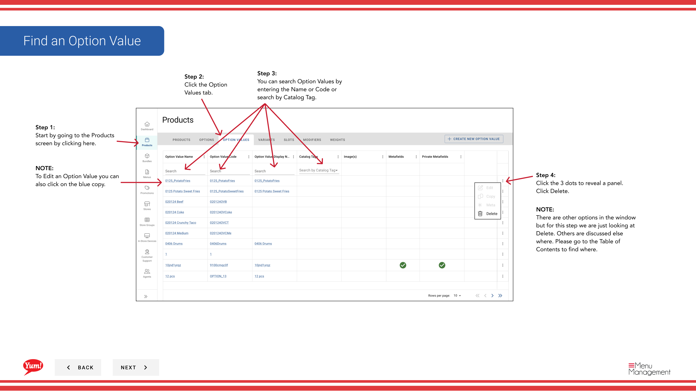
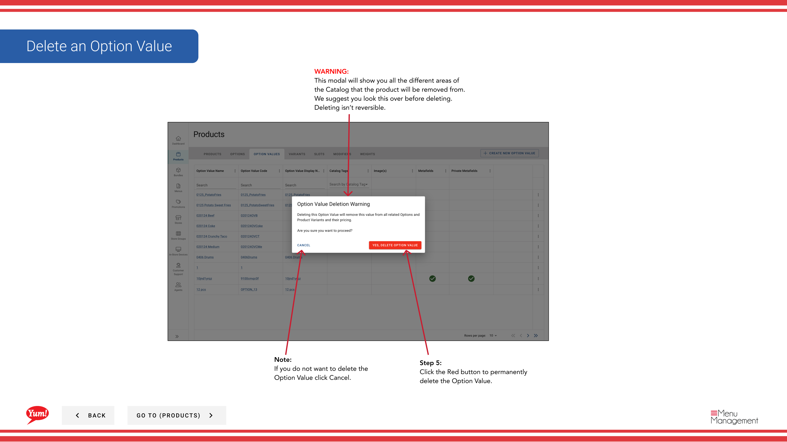

# Löschen eines Optionswerts

## Was diese Anleitung deckt

Entfernt eine bestimmte Wahl von einer Optionsgruppe, wenn sie eingestellt oder nicht mehr benötigt wird.

## Schritte

**Step 1:** Navigieren Sie mit dem linken Navigationsmenü in den Abschnitt **Produkte**.

**Step 2:** Klicken Sie auf die Registerkarte **Optionswerte**.

**Step 3:** Suchen Sie nach dem Optionswert, den Sie löschen möchten, indem Sie den Namen, den Code oder den Katalog Tag im Suchfeld eingeben.

**Step 4:** Klicken Sie auf das Dreipunkt-Menü neben dem Optionswert, dann wählen Sie **Delete**.

**Step 5:** Eine Bestätigungsmodalität wird angezeigt, die alle Bereiche des Systems zeigt, in denen dieser Optionswert verwendet wird. Überprüfen Sie dies sorgfältig, um sicherzustellen, dass Sie die richtige Wahl löschen.

**Step 6:** Klicken Sie auf die rote **Delete** Schaltfläche, um den Optionswert dauerhaft zu entfernen.

## Anmerkungen

:::caution
Die Löschung eines Optionswerts ist dauerhaft und kann nicht rückgängig gemacht werden. Die Auswahl wird von allen Produkten entfernt, die es anbieten.
:::

:::tip
Sie können die Optionswerte nach Name, Code oder Catalog Tag suchen, um schnell den Artikel zu finden, den Sie löschen möchten.
:::

:::caution
Klicken Sie auf **Cancel**, wenn Sie nicht mit Löschung fortfahren möchten.
:::

---

* Teil der[Admin Portal Guide](/docs/admin-portal-guide)· Abschnitt: Produkte*