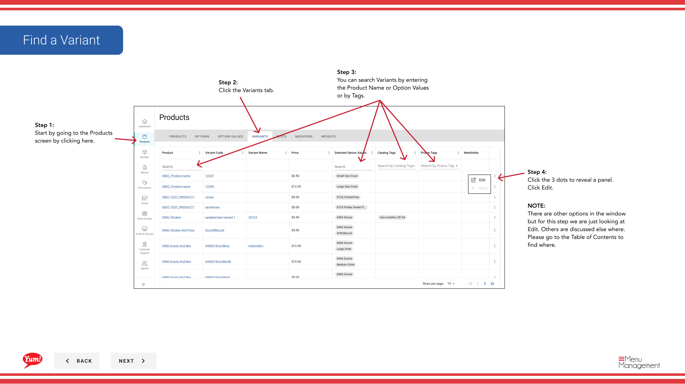
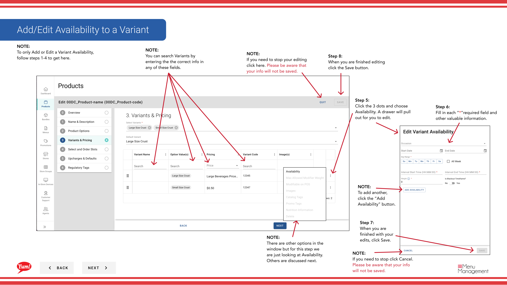

# Variant bearbeiten

## Was diese Anleitung deckt

Aktualisiert den Code einer Produktvariante, Preise, Slots, Verfügbarkeit, Nährwertinfo, Allergene, Ausschlüsse oder Bilder, nachdem das Produkt erstellt wurde.

## Schritte

**Step 1:** Navigieren Sie mit dem linken Navigationsmenü in den Abschnitt **Produkte**.

**Step 2:** Klicken Sie auf die Registerkarte **Variants**.

**Step 3:** Suchen Sie nach der Variante, die Sie bearbeiten möchten, indem Sie den Produktnamen, Optionswerte oder Tags im Suchfeld eingeben.

**Step 4:** Klicken Sie auf das Dreipunktmenü neben der Variante, dann wählen Sie **Bearbeiten**.

**Step 5:** Sie sehen das Formular zur Bearbeitung der Variante mit blauen Abschnittslinks. Klicken Sie auf jeden blauen Link, um direkt zu diesem Abschnitt zu springen:
- **Basic Information** — Variante ändern
- **Preis** — Variantenpreis hinzufügen oder bearbeiten
- **Slots* — Slot-Beauftragungen hinzufügen oder bearbeiten
- ** Verfügbarkeit** — Zeitbasierte Verfügbarkeitsfenster einstellen
- **Nutrition** — Nährwertinformationen hinzufügen
- **Allergene/Ausschlüsse*
- **Bilder** — Variantenbilder hinzufügen oder bearbeiten

**Step 6:** Aktualisieren Sie die Variantenangaben nach Bedarf. Mit * markierte Felder sind erforderlich.

### Variablencode
Klicken Sie im Feld **Variant Code**, um es zu bearbeiten. Klicken Sie auf **Save**, wenn Sie fertig sind. Klicken **Cancel** wird den Code nicht speichern.

### Preise
Klicken Sie in der Preisliste, um das Feld Preiseingabe anzuzeigen. Geben Sie den Preis ein und klicken Sie auf **Save**.

### Verfügbarkeit
Klicken Sie auf **Verfügbarkeit*, um zeitbasierte Fenster (z.B. "Breakfast 6am–11am") einzustellen. Klicken Sie auf **Verfügbarkeit**, um mehrere Fenster hinzuzufügen. Klicken Sie auf **Save**, wenn Sie fertig sind.

### Ernährungshinweise
Klicken Sie auf das Dreipunkt-Menü neben den Ernährungseinträgen und wählen Sie **Bearbeiten** zum Update oder klicken Sie auf **Ernährungsinformationen**, um neue Einträge hinzuzufügen. Klicken Sie auf **Save**, wenn Sie fertig sind.

### Allergene/Ausschlüsse
Überprüfen Sie alle Boxen, die für diese Variante gelten. Klicken Sie auf **Save**, wenn Sie fertig sind.

### Bilder
Klicken Sie auf ** Bild hinzufügen*, um Bilder hochzuladen. Toggle **Primary Image** auf Ja, wenn dies das Hauptbild sein sollte. Klicken Sie auf **Save**, wenn Sie fertig sind.

**Step 7:** Wenn Sie mit allen Bearbeitungen fertig sind, klicken Sie in jedem Abschnitt auf die Schaltfläche ** speichern**. Die Schaltfläche Speichern funktioniert genauso über alle Schubladen.

## Anmerkungen

:::caution
Klicken Sie auf **Cancel** in allen Schubladendisards alle ungehinderten Änderungen in diesem Abschnitt.
:::

:::tip
Sie können direkt zu einem Abschnitt springen, indem Sie auf den blauen Abschnitt Link anstatt zu scrollen.
:::

:::tip
Sie können Varianten nach Produktname, Optionswerten oder Tags suchen, um schnell den Artikel zu finden, den Sie bearbeiten möchten.
:::

:::tip
Klicken Sie nach dem Hinzufügen oder Bearbeiten der Preise auf **Save***, bevor Sie in einen anderen Abschnitt wechseln.
:::

:::tip
Toggle **Primary Image*******, um dieses Bild als Hauptbild für diese Variante einzustellen.
:::

---

* Teil der[Admin Portal Guide](/docs/admin-portal-guide)· Abschnitt: Produkte*