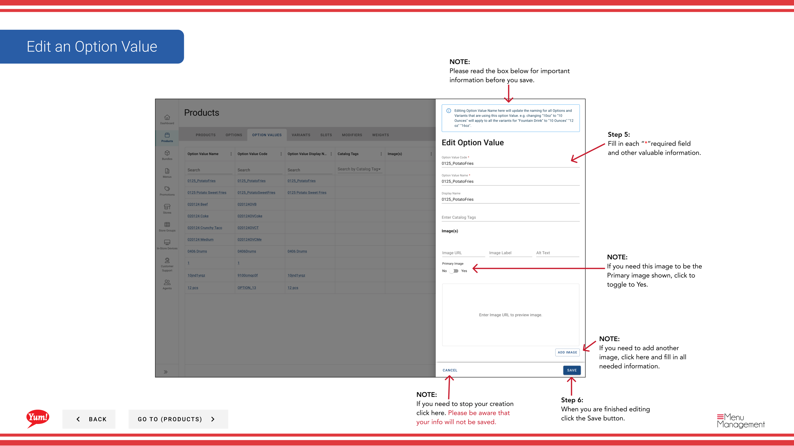

# Bearbeiten eines Optionswerts

## Was diese Anleitung deckt

Aktualisiert den Namen eines vorhandenen Optionswerts, Anzeigeeigenschaften oder Bilder, um Menüänderungen zu reflektieren.

## Schritte

**Step 1:** Navigieren Sie mit dem linken Navigationsmenü in den Abschnitt **Produkte**.

**Step 2:** Klicken Sie auf die Registerkarte **Optionswerte**.

**Step 3:** Suchen Sie nach dem Optionswert, den Sie bearbeiten möchten, indem Sie den Namen, den Code oder den Katalog Tag im Suchfeld eingeben.

**Step 4:** Klicken Sie auf das Dreipunktmenü neben dem Optionswert, dann wählen Sie **Bearbeiten**.

**Step 5:** Aktualisieren Sie die Option Wertdetails. Mit * markierte Felder sind erforderlich.

| Feld | Eingeben | Anmerkungen |
|-------|--------------|-------|
| **Optionswertcode*** | Kennung | Kann nach der Schöpfung nicht geändert werden |
| **Optionswert Name*** | Die Auswahl an Kunden | z.B. „Large“, „Originalrezept“, „Hot & Spicy“ |
| ** Name anzeigen** | Kürzeres Etikett für begrenzten Bildschirmraum | Defaults to Option Value Name wenn leer gelassen |
| **Image** | Optionales Bild für diese Wahl | Toggle **Primary Image** auf Ja, wenn dies das Hauptbild ist. Klicken Sie auf **Ein weiteres Bild hinzufügen*, um mehr hinzuzufügen. |

**Step 6:** Wenn Sie fertig sind, klicken Sie auf die Schaltfläche **Save***.

## Anmerkungen

:::caution
Klicken Sie auf **Cancel** verworfen alle unerwünschten Änderungen.
:::

:::tip
Toggle **Primary Image*******, um dieses Bild als Hauptbild für diesen Optionswert einzustellen.
:::

:::tip
Sie können mehrere Bilder hinzufügen, indem Sie auf **Ein weiteres Bild hinzufügen**.
:::

:::tip
Sie können Optionswerte nach Name, Code oder Katalog Tag suchen.
:::

---

* Teil der[Admin Portal Guide](/docs/admin-portal-guide)· Abschnitt: Produkte*