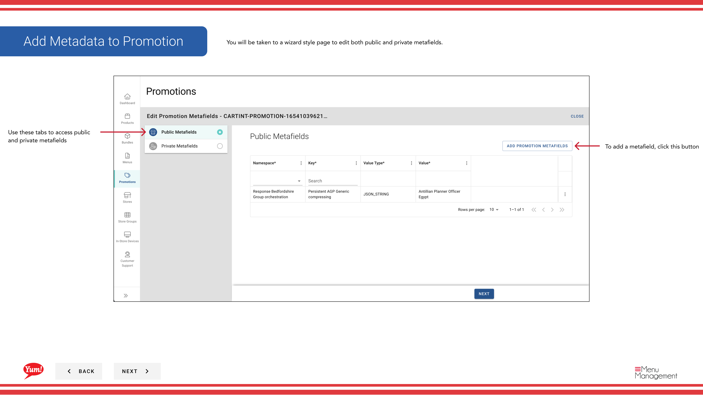

# Metadaten zur Promotion hinzufügen

## Was diese Anleitung deckt

Benutzerdefinierte Metadaten (Schlüsselwertpaare) an eine Förderung für Systemintegration oder marktspezifische Tracking-Anforderungen.

## Schritte

**Step 1:** Navigieren Sie mit dem linken Navigationsmenü auf den Abschnitt **Promotions**.

**Step 2:** Finden Sie die Aktion, die Sie aktualisieren möchten. Klicken Sie auf die Schaltfläche **Aktionsmenü* (drei Punkte), dann wählen Sie **Meta****.

**Step 3:** Der Metadaten-Assistent wird geöffnet. Sie können sowohl öffentliche als auch private Metafelder hinzufügen.

**Step 4:** Um ein Metafeld hinzuzufügen, klicken Sie auf die Schaltfläche **+ Fügen Sie Metafield** hinzu. Geben Sie Folgendes ein:

| Feld | Eingeben | Anmerkungen |
|-------|--------------|-------|
| **Key** | Der Name des Metadatenfeldes | z.B. "campaign id", "region". Definiert von Ihrem technischen Team. |
| **Value** | Der Wert für dieses Feld | z.B. „CAMP123“, „APAC“. Muss mit dem Format übereinstimmen, das Ihre Integrationen erwarten. |
| **Public/Privat** | Um die Sicht zu definieren | Öffentliche Metadaten sind für Integrationen sichtbar. Private ist für internes Tracking. |

**Step 5:** Klicken Sie auf die Schaltfläche **Save**, um die Metadaten anzuwenden.

:::tip
Fügen Sie nur Metadaten hinzu, wenn Ihr technisches Team die für Ihre Systemintegration erforderlichen genauen Schlüssel und Werte festgelegt hat. Metadaten werden verwendet, um zusätzliche Daten an angeschlossene Systeme weiterzugeben.
:::

## Ähnliche Anleitungen

- [Eine Promotion erstellen](/docs/admin-portal-guide/promotions/create-a-promotion/)
- [Promotion bearbeiten](/docs/admin-portal-guide/promotions/edit-a-promotion/)

---

* Teil der[Admin Portal Guide](/docs/admin-portal-guide)· Sektion: Promotionen*