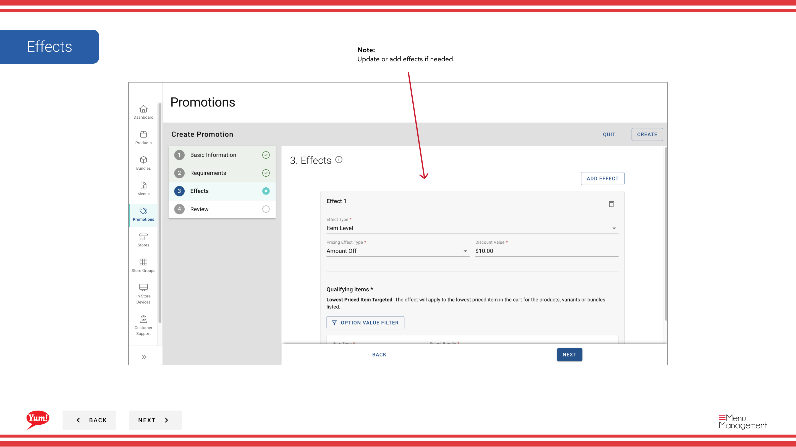
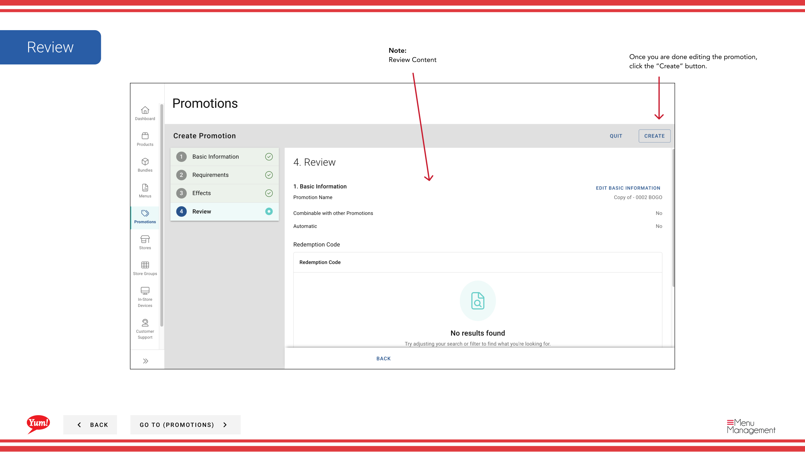

# Kopie Promotion

## Was diese Anleitung deckt

Dupliziert eine bestehende Promotion als Ausgangspunkt für eine neue, reduziert die Rüstzeit für ähnliche Angebote.

## Schritte

**Step 1:** Navigieren Sie mit dem linken Navigationsmenü auf den Abschnitt **Promotions**.

**Step 2:** Finden Sie die Promotion, die Sie kopieren möchten. Klicken Sie auf die Schaltfläche **Aktionsmenü* (drei Punkte), dann wählen Sie **Copy****.

**Step 3:** Der Promotion Wizard wird mit allen Details aus der ursprünglichen Promotion vorgefüllt öffnen. Aktualisieren Sie die Werbedetails nach Bedarf:

- **Promotion Name** — Die kopierte Promotion standardmäßig „Copy of - [Original Name]“. Ändern Sie dies auf einen einzigartigen Namen.
- ** Name anzeigen** — Nach Bedarf aktualisieren.
- **Beschreibung** — Nach Bedarf aktualisieren.
- **Promotion Flow** — Falls erforderlich ändern.
- **Anforderungen** — Nach Bedarf hinzufügen, entfernen oder ändern.
- **Effekte** — Nach Bedarf hinzufügen, entfernen oder ändern.

**Step 4:** Überprüfen Sie alle Ihre Änderungen und klicken Sie auf die **Kreate* Schaltfläche, um die neue Aktion zu speichern.

:::tip
Die kopierte Förderung ist unabhängig vom Original. Änderungen an beiden Aktionen werden den anderen nicht beeinflussen.
:::

## Ähnliche Anleitungen

- [Eine Promotion erstellen](/docs/admin-portal-guide/promotions/create-a-promotion/)
- [Promotion bearbeiten](/docs/admin-portal-guide/promotions/edit-a-promotion/)
- [Promotions zu Store Groups zuweisen](/docs/admin-portal-guide/promotions/assign-promotions-to-store-groups/)

---

* Teil der[Admin Portal Guide](/docs/admin-portal-guide)· Sektion: Promotionen*