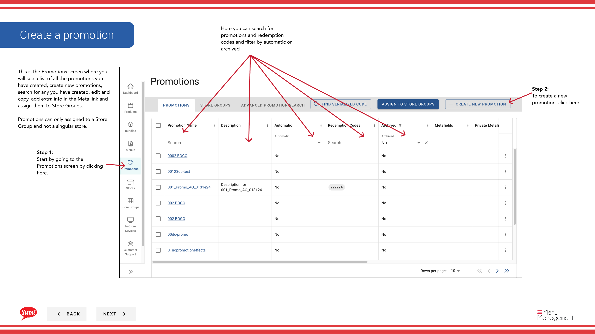
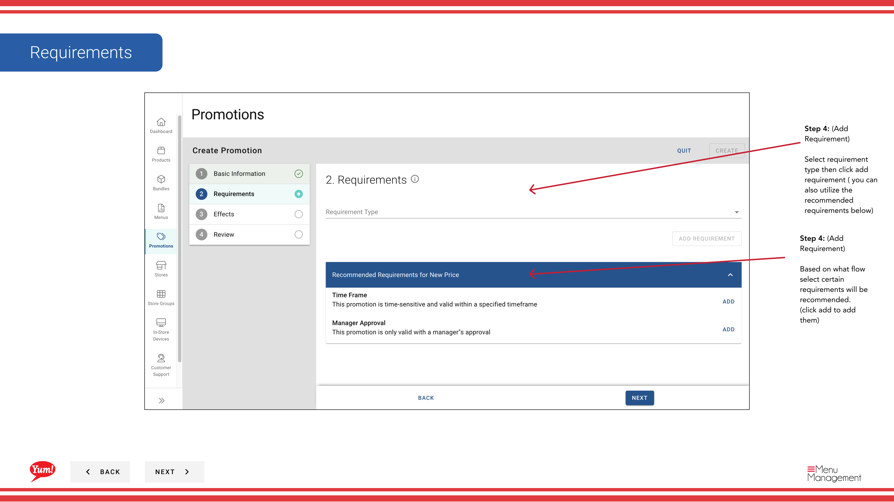

# Eine Promotion erstellen

## Was diese Anleitung deckt

Baut eine neue Werberegel in Atlas — Definition der Rabatt-Typ, Bedingungen, Gültigkeitsdauer und anwendbare Speichergruppen — so kann es Kunden über digitale Bestellkanäle zu Oberflächen.

## Schritte

**Step 1:** Navigieren Sie mit dem linken Navigationsmenü auf den Abschnitt **Promotions**.

**Step 2:** Klicken Sie auf die Schaltfläche **+ Neue Promotion** erstellen.

**Step 3:** Füllen Sie die Werbedetails aus. Mit * markierte Felder sind erforderlich.

| Feld | Eingeben | Anmerkungen |
|-------|--------------|-------|
| **Promotion Name*** | Interner Name für diese Förderung | z.B. "BOGO Zinger Mai 2024". Nur für die Betreiber sichtbar. |
| **Zeichenname*** | Kundenorientierter Name auf Bestellkanälen | z.B. "Buy 1 Get 1 Free Zinger". Halten Sie es kurz und überzeugend. |
| **Beschreibung** | Erklärt die Förderung für Kunden | Auf der Bestellschnittstelle angezeigt. |

**Step 4:** Wählen Sie einen **Promotion Flow** basierend auf der Art der Promotion, die Sie erstellen.

| Strom | Verwenden Sie, wenn... |
|------|-------------|
| **Neuer Preis** | Sie möchten einen neuen Fixpreis für einen Qualifying-Artikel festlegen |
| **Buy 1 Holen Sie sich 1** | Kunde kauft einen Artikel und erhält einen weiteren kostenlosen oder ermäßigten |
| **Ermäßigter Preis** | Sie wollen einen Prozentsatz oder eine feste Kürzung anwenden |
| **Kundenförderung** | Die Förderung passt nicht zu den oben genannten Strömen |

**Step 5:** **Anforderungen** — die Bedingungen, die ein Kunde erfüllen muss, um die Aktion auszulösen. Basierend auf Ihrem ausgewählten Fluss werden empfohlenen Anforderungen unterhalb der Anforderungsauswahl angezeigt. Klicken Sie auf ****, um eine empfohlene Anforderung zu enthalten, oder wählen Sie einen Anforderungstyp aus dem Dropdown und klicken Sie auf **Anforderung**, um eine benutzerdefinierte Bedingung zu erstellen.

 

**Step 6:** Fügen Sie einen **Effect** hinzu und füllen Sie die Effektdetails aus. Der Effekt definiert, welchen Rabatt oder Belohnung der Kunde erhält, wenn die Anforderungen erfüllt sind.

**Step 7:** Überprüfen Sie alle eingegebenen Informationen und klicken Sie auf **Kreate**, um die Promotion zu speichern.

:::tip
Promotionen können nur einer **Store Group* zugeordnet werden, nicht einem einzelnen Store. Siehe[Promotions zu Store Groups zuweisen](/docs/admin-portal-guide/promotions/assign-promotions-to-store-groups/)nach der Erstellung Ihrer Promotion.
:::

## Ähnliche Anleitungen

- [Promotions zu Store Groups zuweisen](/docs/admin-portal-guide/promotions/assign-promotions-to-store-groups/)
- [Kopieren Sie eine Promotion](/docs/admin-portal-guide/promotions/copy-promotion/)

---

* Teil der[Admin Portal Guide](/docs/admin-portal-guide)· Sektion: Promotionen*