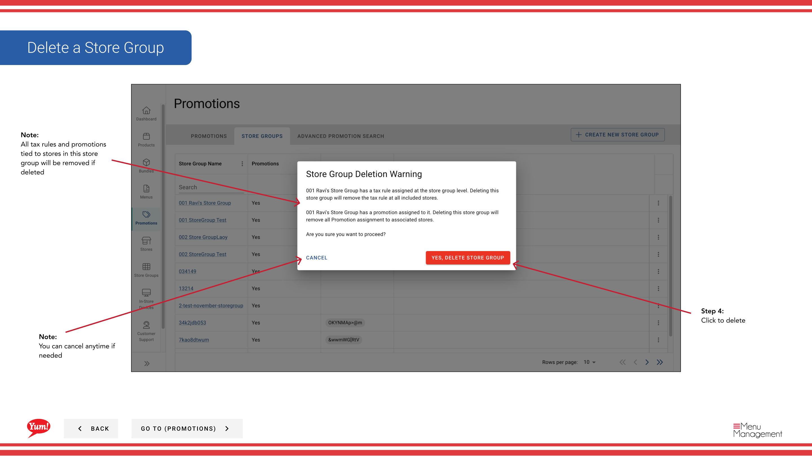

# Löschen einer Store Group

## Was diese Anleitung deckt

Entfernt permanent eine Speichergruppe aus dem System.

## Schritte

**Step 1:** Beginnen Sie, indem Sie auf den Promotions-Bildschirm klicken.
**Step 2:** Klicken Sie auf die Registerkarte Store Gruppen

**Step 3:** Klicken Sie auf die Schaltfläche Aktion, dann klicken Sie auf “löschen”

**Step 4:** Klicken Sie auf Löschen

## Anmerkungen

:::tip
Sie können nach der Speichergruppe suchen, die Sie löschen möchten
:::

:::tip
Sie können jederzeit stornieren, wenn nötig
:::

:::tip
Alle Steuerregeln und Werbeaktionen, die an die Filialen in dieser Filialgruppe gebunden sind, werden entfernt, wenn gelöscht
:::

## Weitere Informationen

- Promotionen - Löschen einer Store-Gruppe
- Dies ist der Promotions-Bildschirm, in dem Sie eine Liste aller Aktionen sehen, die Sie erstellt haben, neue Aktionen erstellen, nach jedem suchen, das Sie erstellt haben, bearbeiten und kopieren, zusätzliche Informationen in der Meta-Link hinzufügen und ihnen Store Groups zuweisen. Promotionen können nur einer Store-Gruppe zugeordnet werden und nicht einem einzigen Store.

---

* Teil der[Admin Portal Guide](/docs/admin-portal-guide)· Sektion: Promotionen*