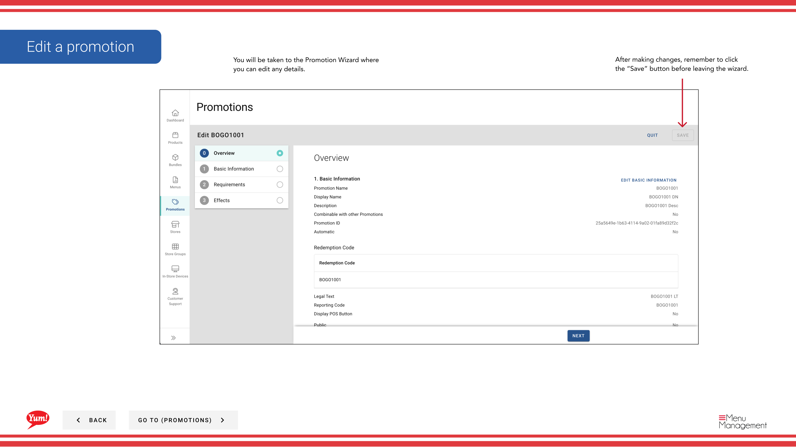

# Promotion bearbeiten

## Was diese Anleitung deckt

Aktualisiert die Konfiguration einer bestehenden Promotion, wie Gültigkeitstermine, Rabattwerte oder Anforderungs- und Effekteinstellungen.

## Schritte

**Step 1:** Navigieren Sie mit dem linken Navigationsmenü auf den Abschnitt **Promotions**.

**Step 2:** Finden Sie die Aktion, die Sie bearbeiten möchten, indem Sie die Tabelle durchsuchen oder die Suchleiste verwenden. Klicken Sie auf den **Promotionsnamen*, um den Werbeassistenten zu öffnen.

**Step 3:** Aktualisieren Sie alle Werbedetails (Name, Anzeigename, Beschreibung, Fließtyp, Anforderungen, Effekte oder Gültigkeitsdauer).

**Step 4:** Wenn Sie Änderungen abgeschlossen haben, klicken Sie auf die Schaltfläche **Save**, um Ihre Updates anzuwenden.

:::tip
Der Promotion Wizard führt Sie durch jeden Abschnitt. Sie können auf jede Schrittnummer klicken, um zu diesem Abschnitt zu springen oder sequentiell fortzufahren.
:::

## Ähnliche Anleitungen

- [Eine Promotion erstellen](/docs/admin-portal-guide/promotions/create-a-promotion/)
- [Kopieren Sie eine Promotion](/docs/admin-portal-guide/promotions/copy-promotion/)
- [Archive a Promotion](/docs/admin-portal-guide/promotions/archive-a-promotion/)

---

* Teil der[Admin Portal Guide](/docs/admin-portal-guide)· Sektion: Promotionen*