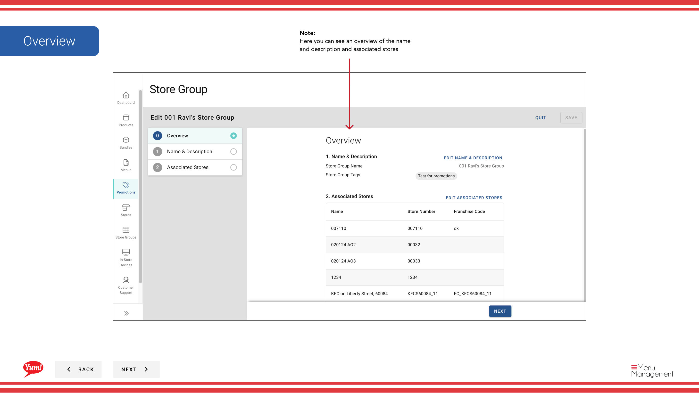

# Eine Store-Gruppe bearbeiten

## Was diese Anleitung deckt

Aktualisiert die Details oder Mitgliedschaft einer Speichergruppe.

## Schritte

**Step 1:** Beginnen Sie, indem Sie auf den Promotions-Bildschirm klicken.
**Step 2:** Klicken Sie auf die Registerkarte Store Gruppen

**Step 3:** Finden Sie die Store-Gruppe, die Sie bearbeiten möchten, und klicken Sie auf den Shop Gruppennamen Link

**Step 4:** Klicken Sie auf Speichern, um Ihre Änderungen zu speichern.

## Anmerkungen

:::tip
Es gibt mehrere Möglichkeiten, eine Speichergruppe zu bearbeiten. Dies ist der Weg, es durch Promotions zu tun. Sie können es auch über Store Groups in der Hauptnavigation tun.
:::

:::tip
Hier sehen Sie einen Überblick über den Namen und die Beschreibung und die zugehörigen Stores
:::

:::tip
Hier können Sie den Namen und die Beschreibung aktualisieren oder Gruppen-Tags speichern
:::

:::tip
Hier können Sie Shops hinzufügen oder entfernen
:::

## Weitere Informationen

- Promotionen - Eine Store-Gruppe bearbeiten
- Dies ist der Promotions-Bildschirm, in dem Sie eine Liste aller Aktionen sehen, die Sie erstellt haben, neue Aktionen erstellen, nach jedem suchen, das Sie erstellt haben, bearbeiten und kopieren, zusätzliche Informationen in der Meta-Link hinzufügen und ihnen Store Groups zuweisen. Promotionen können nur einer Store-Gruppe zugeordnet werden und nicht einem einzigen Store.

---

* Teil der[Admin Portal Guide](/docs/admin-portal-guide)· Sektion: Promotionen*