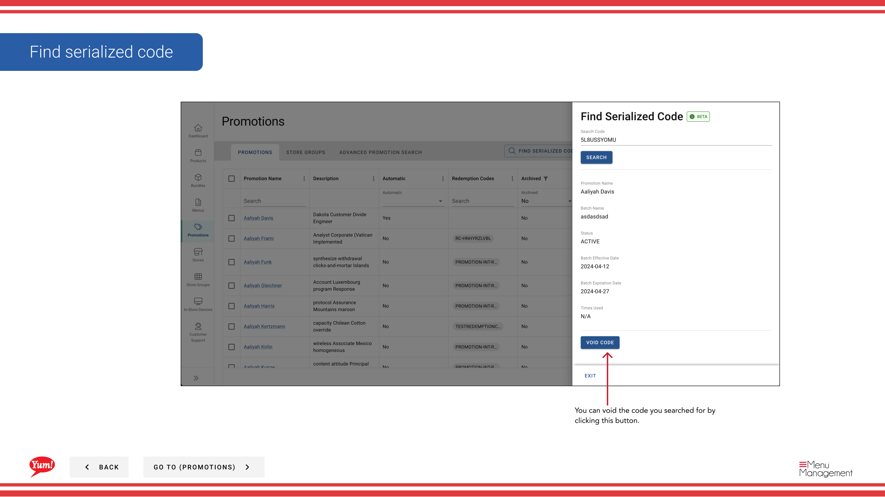

# Serialisierte Code finden

## Was diese Anleitung deckt

Findet einen bestimmten serienmäßigen Werbecode innerhalb von Atlas, der bei der Überprüfung des Erlösungsstatus, der Problembehebung oder der Verwaltung der Code-Validität verwendet wird.

## Schritte

**Step 1:** Navigieren Sie mit dem linken Navigationsmenü auf den Abschnitt **Promotions**.

**Step 2:** Klicken Sie auf die Schaltfläche **Serialized Code** (in der Regel sichtbar in der Nähe der Promotionsliste).

**Step 3:** Geben Sie den serialisierten Code ein, den Sie im **search-Feld* suchen möchten und klicken Sie auf die **Search** Taste.

**Step 4:** Das System wird die Codedetails anzeigen, einschließlich:

- **Codewert** Der eigentliche Codetext
- **Promotion Name** — Die Förderung dieses Codes ist gebunden an
- **Status** Ob der Code aktiv, eingelöst oder nichtig ist
- **Abweichendes Datum* Wenn der Code abläuft

**Step 5 (Optional):** Wenn Sie einen Code deaktivieren möchten, klicken Sie auf die Schaltfläche **Void Code***. Ein ungültiger Code kann nicht eingelöst werden.

:::tip
Verwenden Sie diese Funktion, um zu überprüfen, ob ein Code vorhanden ist, überprüfen Sie seinen Erlösungsstatus oder Fehlerbehebung von Kundenproblemen mit bestimmten Codes.
:::

## Ähnliche Anleitungen

- [Erstellen Sie serialisierten Code](/docs/admin-portal-guide/promotions/create-serialized-code/)
- [Eine Promotion erstellen](/docs/admin-portal-guide/promotions/create-a-promotion/)

---

* Teil der[Admin Portal Guide](/docs/admin-portal-guide)· Sektion: Promotionen*