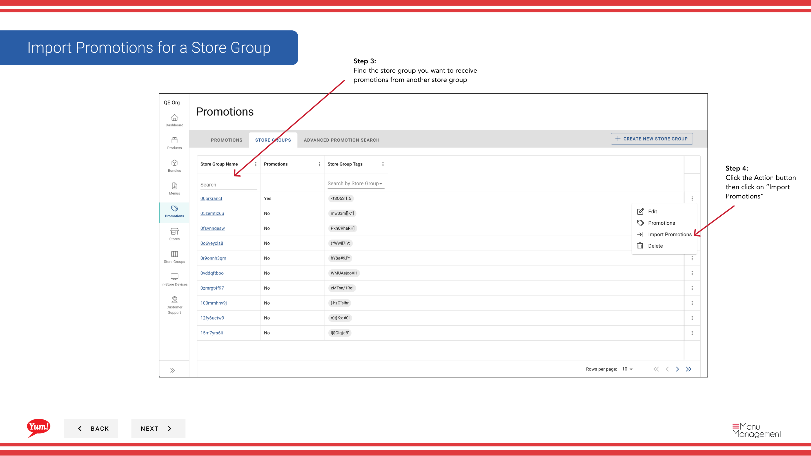

# Import Promotions für eine Store-Gruppe

## Was diese Anleitung deckt

Bulk-importiert Werbeaufträge von einer Filialgruppe zu einer anderen, bei der Einrichtung großer Werbekampagnen in vielen Läden oder beim Duplizieren von Werbeaktionen aus einer bestehenden Konfiguration.

## Schritte

**Step 1:** Navigieren Sie mit dem linken Navigationsmenü auf den Abschnitt **Promotions**.

**Step 2:** Klicken Sie auf die Registerkarte **Store Groups*.

**Step 3:** Finden Sie die Store-Gruppe, die **receive** die Promotions (die Zielgruppe). Dies ist die Gruppe, in die Sie Werbeaktionen importieren möchten.

**Step 4:** Klicken Sie auf die Schaltfläche **Aktionsmenü* (drei Punkte) neben dem Speichergruppennamen, dann wählen Sie **Import Promotions**.

**Step 5:** Ein Dialog erscheint, in dem Sie die Speichergruppe auswählen möchten, um Werbeaktionen zu importieren ** von** (die Quellgruppe). Suchen Sie nach und wählen Sie die Speichergruppe, die die Werbeaktionen hat, die Sie kopieren möchten.

**Step 6:** Überprüfen Sie die Importübersicht und klicken Sie auf **Save**, um den Import abzuschließen.

:::caution
**Important:** Importieren von Promotions wird ** ersetzen** alle vorhandenen Promotions im Zusammenhang mit der Ziel-Shop-Gruppe. Die Operation kann nicht rückgängig gemacht werden. Stellen Sie sicher, dass Sie vor der Bestätigung in die richtige Speichergruppe importieren.
:::

:::tip
Wenn Sie bestimmte Werbeaktionen anstatt alle von ihnen importieren möchten, schalten Sie die Option "Import All" aus und wählen Sie stattdessen einzelne Werbeaktionen aus.
:::

## Ähnliche Anleitungen

- [Promotionen für eine Store-Gruppe anzeigen](/docs/admin-portal-guide/promotions/view-promotions-for-a-store-group/)
- [Promotions zu Store Groups zuweisen](/docs/admin-portal-guide/promotions/assign-promotions-to-store-groups/)
- [Import Promotions (Geschäftsgruppen)](/docs/admin-portal-guide/store-groups/import-promotions-for-a-store-group/)

---

* Teil der[Admin Portal Guide](/docs/admin-portal-guide)· Sektion: Promotionen*