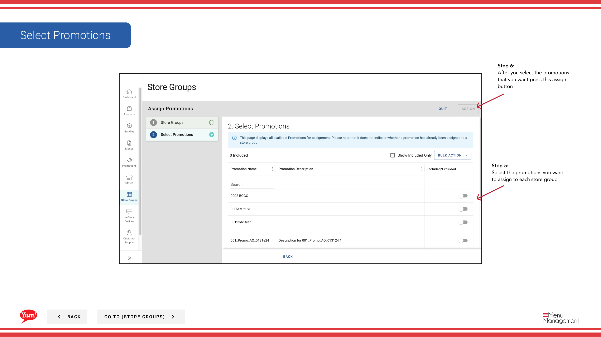

# Promotionen zuweisen

## Was diese Anleitung deckt

Gibt einer Speichergruppe eine oder mehrere Werbeaktionen zu, die sie gleichzeitig in allen Mitgliedsläden aktivieren.

## Schritte

**Step 1:** Navigieren Sie mit dem linken Navigationsmenü in den Bereich **Store Groups**.

**Step 2:** Klicken Sie auf die Schaltfläche **Assign Promotions** (in der Regel prominent in der Nähe der Seite angezeigt).

**Step 3:** Wählen Sie die Aktion(en) aus, die Sie zuordnen möchten. Sie können:

- ** Überprüfen Sie das Kontrollkästchen* neben jedem Werbenamen, um es auszuwählen
- ** Verwenden Sie "Select All"*, um alle sichtbaren Aktionen auszuwählen (oder **"Alle auswählen"*, um Auswahl zu löschen)
- **Suche*** für bestimmte Aktionen mit der Suchleiste

**Step 4:** Sobald Sie Ihre Aktionen ausgewählt haben, klicken Sie auf die Schaltfläche **Next** oder klicken Sie auf die nächste Schrittanzeige, um fortzufahren.

**Step 5:** Wählen Sie die Speichergruppe(n), die diese Promotions erhalten sollte. Sie können:

- ** Überprüfen Sie das Kontrollkästchen* neben jedem Speichergruppennamen
- **Search*** für bestimmte Speichergruppen nach Namen oder Tag

**Step 6:** Überprüfen Sie Ihre Auswahl und klicken Sie auf die Schaltfläche **Assign**, um die Aktionen auf die ausgewählten Speichergruppen anzuwenden.

:::tip
Einmal zugewiesen, werden die Werbeaktionen sofort für alle Speicher in den ausgewählten Speichergruppen aktiv und werden auf ihren digitalen Bestellkanälen angezeigt.
:::

:::tip
Sie können auch Promotionen aus dem Bereich Promotions zuweisen. Siehe[Promotions zu Store Groups zuweisen](/docs/admin-portal-guide/promotions/assign-promotions-to-store-groups/)für den Workflow.
:::

## Ähnliche Anleitungen

- [Eine Promotion erstellen](/docs/admin-portal-guide/promotions/create-a-promotion/)
- [Promotionen bearbeiten](/docs/admin-portal-guide/store-groups/edit-promotions/)
- [Werbeaktionen von Store Group](/docs/admin-portal-guide/store-groups/unassign-promotions-from-store-group/)
- [Import Promotions für eine Store-Gruppe](/docs/admin-portal-guide/store-groups/import-promotions-for-a-store-group/)

---

* Teil der[Admin Portal Guide](/docs/admin-portal-guide)· Sektion: Store Groups*