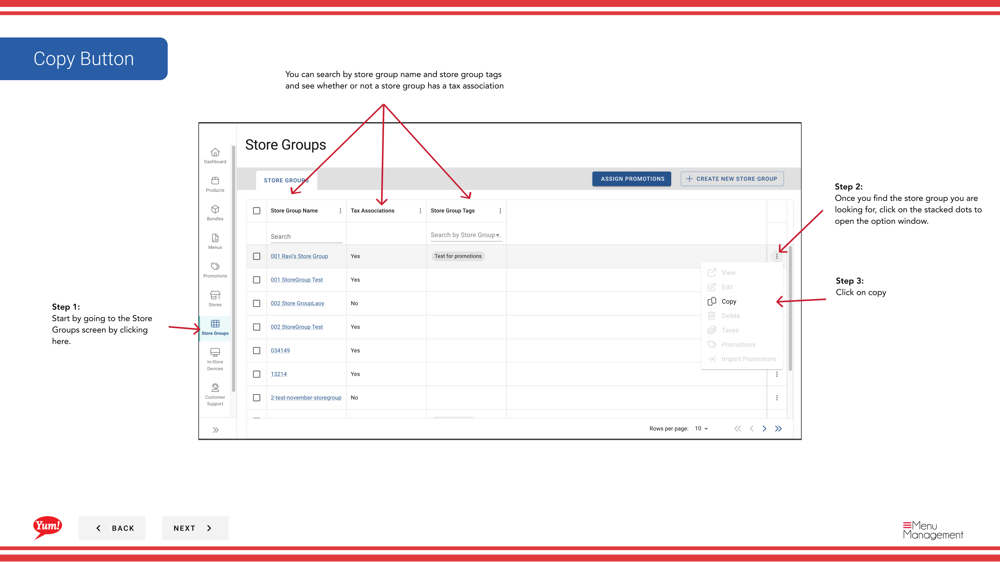
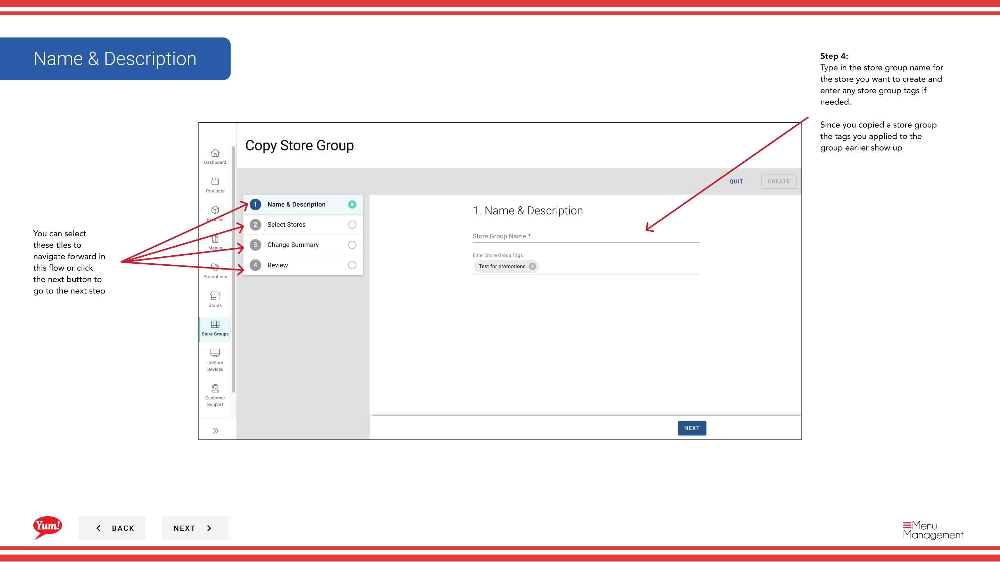

# Kopieren einer Store-Gruppe

## Was diese Anleitung deckt

Dupliziert eine Speichergruppen-Konfiguration als Ausgangspunkt für eine neue Gruppe, Kopieren von Speichern und Tags, aber Erstellen einer unabhängigen neuen Speichergruppe.

## Schritte

**Step 1:** Navigieren Sie mit dem linken Navigationsmenü in den Bereich **Store Groups**.

**Step 2:** Finden Sie die Speichergruppe, die Sie kopieren möchten, indem Sie die Tabelle durchsuchen oder die Suchleiste verwenden. Klicken Sie auf die Schaltfläche **Aktionsmenü* (drei Punkte) neben dem Speichergruppennamen.

**Step 3:** Klicken Sie auf **Kopieren**.

**Step 4:** Aktualisieren Sie die Details der Speichergruppe:

| Feld | Eingeben | Anmerkungen |
|-------|--------------|-------|
| ** Store Group Name*** | Ein neuer, einzigartiger Name für diese Gruppe | Das System kopiert den ursprünglichen Namen; Sie müssen es ändern. z.B. "NSW Franchise Group - Copy". |
| **Store Group Tags** | Etiketten für Filterung und Berichterstattung | Tags aus der ursprünglichen Gruppe sind automatisch enthalten. Sie können bei Bedarf hinzufügen oder entfernen. |

**Step 5:** Überprüfung und Anpassung der Shop-Mitgliedschaft bei Bedarf:

- **Stores aus der ursprünglichen Gruppe werden automatisch ausgewählt** (Zugschalter sind ON)
- **Toggle OFF**, um Geschäfte zu entfernen, die Sie in der neuen Gruppe nicht wollen
- **Toggle ON** um zusätzliche Speicher hinzuzufügen
- Verwenden Sie den **"Zeigen Sie mich enthalten"* Filter, um schnell nur ausgewählte Läden anzeigen
- ** Filter nach Store Nummer, Store Name oder Franchise Code**, um bestimmte Läden zu finden

**Step 6:** Überprüfen Sie die Zusammenfassung aller Änderungen und klicken Sie auf die **Kreate* Taste, um die neue Speichergruppe zu speichern.

:::tip
Die kopierte Speichergruppe ist unabhängig vom Original. Änderungen an einer Gruppe werden den anderen nicht beeinflussen. Die Store-Mitgliedschaft wird automatisch von der ursprünglichen Gruppe kopiert, kann aber vor dem Speichern geändert werden.
:::

## Ähnliche Anleitungen

- [Erstellen einer Store-Gruppe](/docs/admin-portal-guide/store-groups/create-a-store-group/)
- [Eine Store-Gruppe bearbeiten](/docs/admin-portal-guide/store-groups/edit-a-store-group/)
- [Löschen einer Store Group](/docs/admin-portal-guide/store-groups/delete-a-store-group/)

---

* Teil der[Admin Portal Guide](/docs/admin-portal-guide)· Sektion: Store Groups*