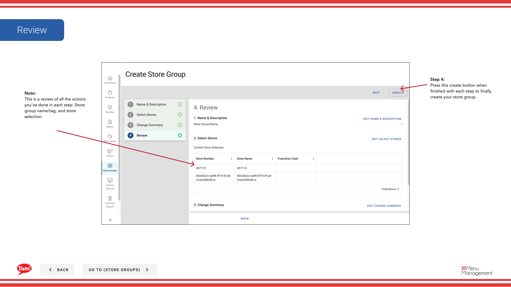

# Erstellen einer Store-Gruppe

## Was diese Anleitung deckt

Erstellt eine benannte Gruppierung von Geschäften, die Menü, Promotion oder Steuerkonfigurationen teilen — eine Grundstruktur für die Verwaltung mehrerer Standorte im Maßstab.

## Schritte

**Step 1:** Navigieren Sie mit dem linken Navigationsmenü in den Bereich **Store Groups**.

**Step 2:** Klicken Sie auf die Schaltfläche **+ Neue Store-Gruppe* erstellen.

**Step 3:** Geben Sie die Shop-Gruppendetails ein. Mit * markierte Felder sind erforderlich.

| Feld | Eingeben | Anmerkungen |
|-------|--------------|-------|
| ** Store Group Name*** | Ein beschreibender Name für diese Gruppe | z.B. "NSW Franchise Group", "Corporate Owned Stores", "Breakfast Pilot 2024". Sollte sich von anderen Gruppen deutlich unterscheiden. |
| **Store Group Tags** | Optionale Etiketten für Filterung und Berichterstattung | z.B. "pilot", "corporate", "franchise". Nützlich für die Organisation und Suche mehrerer Speichergruppen. |

**Step 4:** Wählen Sie die Speicher aus, um diese Gruppe mit der Speichertabelle hinzuzufügen. Sie können:

- ** Filter nach Store Nummer, Store Name oder Franchise Code**, um schnell bestimmte Läden zu finden
- ** Den Schalter** neben jedem Speichernamen zum Hinzufügen oder Entfernen von Speichern aus der Gruppe
- Welche Stores werden bereits ausgewählt, indem Sie die geprüften Schalter suchen

**Step 5:** Überprüfen Sie die Zusammenfassung der Stores, die Sie ausgewählt haben und andere Details. Klicken Sie auf **Kreate**, um die Speichergruppe zu speichern.

:::tip
Ein Speicher kann gleichzeitig mehreren Speichergruppen angehören. Promotionen, Steuerregeln und Menüs werden auf der Ebene der Filiale verwaltet und gelten für alle Mitgliedsläden.
:::

## Ähnliche Anleitungen

- [Eine Store-Gruppe bearbeiten](/docs/admin-portal-guide/store-groups/edit-a-store-group/)
- [Kopieren einer Store-Gruppe](/docs/admin-portal-guide/store-groups/copy-a-store-group/)
- [Stores in einer Store-Gruppe anzeigen](/docs/admin-portal-guide/store-groups/view-stores-in-a-store-group/)
- [Promotionen zuweisen](/docs/admin-portal-guide/store-groups/assign-promotions/)

---

* Teil der[Admin Portal Guide](/docs/admin-portal-guide)· Sektion: Store Groups*