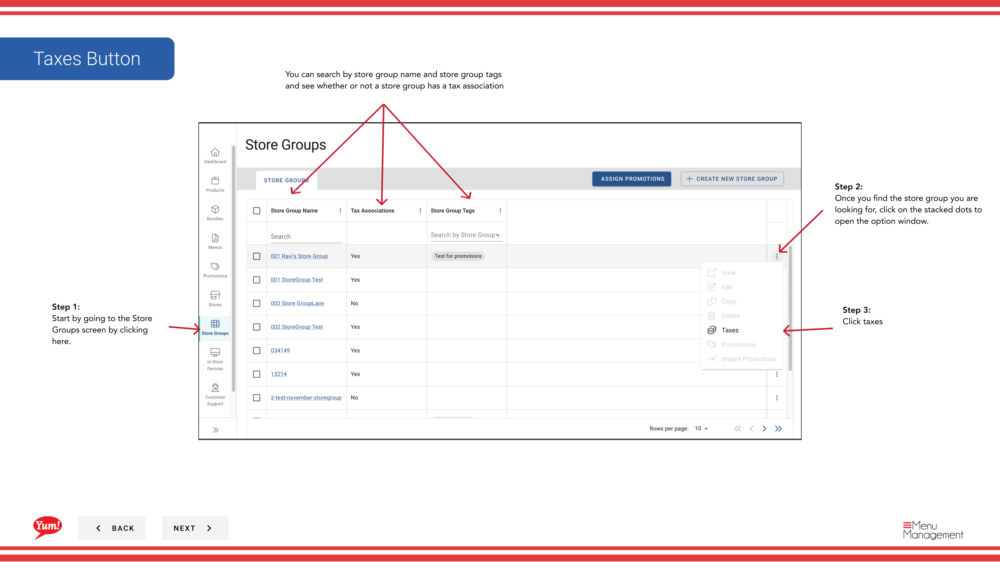
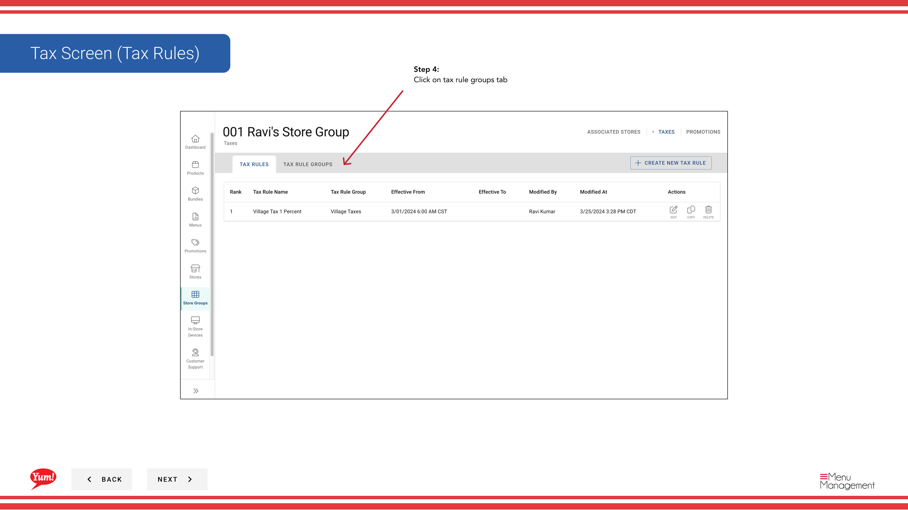

# Steuerregelgruppe erstellen

## Was diese Anleitung deckt

Erstellt eine benannte Steuerregelgruppe, die mehrere verwandte Steuerregeln zusammenbündelt, so dass Sie Steuerkonfigurationen über Filialgruppen organisieren und wiederverwenden können.

## Schritte

**Step 1:** Navigieren Sie mit dem linken Navigationsmenü in den Bereich **Store Groups**.

**Step 2:** Finden Sie die Filialgruppe, in der Sie eine Steuerregelgruppe erstellen möchten. Klicken Sie auf die Schaltfläche **Aktionsmenü* (drei Punkte) neben dem Speichergruppennamen.

**Step 3:** Klicken Sie im Dropdown-Menü auf **Taxes**.

**Step 4:** Klicken Sie auf die Registerkarte **Tax Rule Groups**.

**Step 5:** Klicken Sie auf die Schaltfläche **+ Neue Steuerregelgruppe* erstellen.

**Step 6:** Füllen Sie die Daten der Steuerregelgruppe aus. Mit * markierte Felder sind erforderlich.

| Feld | Eingeben | Anmerkungen |
|-------|--------------|-------|
| **Tax Rule Group Name** | Beschreibungsname für diese Gruppe | z.B. "Standard GST Group", "NSW Reduzierte Steuerordnung". Sollten Sie angeben, welche Steuern enthalten sind. |
| **Zeichenname*** | Name in der Schnittstelle | Üblicherweise gleich oder ähnlich wie der Name der Steuerregelgruppe. |
| **Beschreibung** | Optionale Erläuterung des Ziels der Gruppe | z.B. "GST-Regeln für New South Wales-Standorte". |

**Step 7:** Klicken Sie auf die **Create Tax Group* Schaltfläche, um die Steuerregelgruppe zu speichern.

:::tip
Einmal erstellt, ist eine Steuerregelgruppe unabhängig und kann über mehrere Speichergruppen verwendet werden. Sie können Steuerregelgruppen jederzeit auf diesem Bildschirm bearbeiten, kopieren und löschen.
:::

:::tip
Nach der Erstellung einer Steuerregelgruppe müssen Sie dazu individuelle Steuerregeln hinzufügen. Siehe[Steuerregeln erstellen](/docs/admin-portal-guide/store-groups/create-tax-rules/)für diesen Schritt.
:::

## Ähnliche Anleitungen

- [Steuerregeln erstellen](/docs/admin-portal-guide/store-groups/create-tax-rules/)
- [Eine Store-Gruppe bearbeiten](/docs/admin-portal-guide/store-groups/edit-a-store-group/)

---

* Teil der[Admin Portal Guide](/docs/admin-portal-guide)· Sektion: Store Groups*