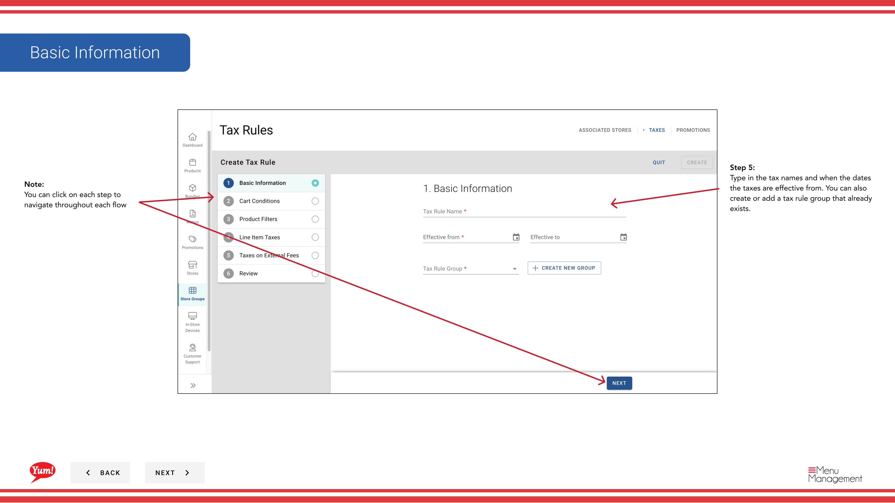
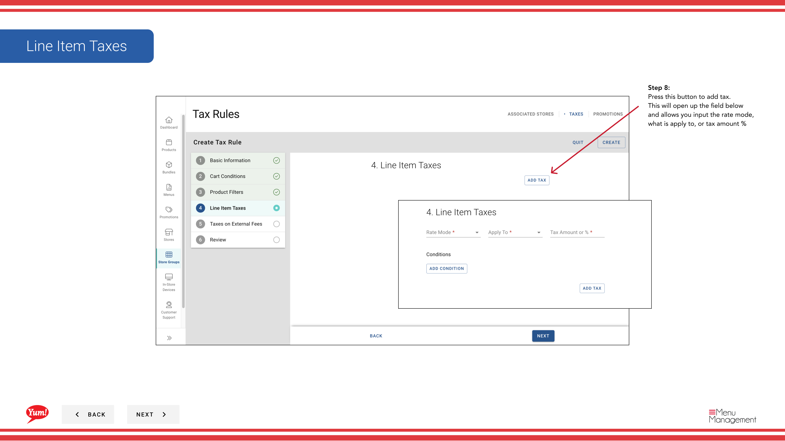

# Steuerregeln erstellen

## Was diese Anleitung deckt

Definiert individuelle Steuerregeln innerhalb einer Filialgruppe, wobei die Steuersätze, Bedingungen und Produktfilter an in den Mitgliedsläden verkauften Gegenständen angegeben werden.

## Schritte

**Step 1:** Navigieren Sie mit dem linken Navigationsmenü in den Bereich **Store Groups**.

**Step 2:** Finden Sie die Filialgruppe, in der Sie eine Steuerregel erstellen möchten. Klicken Sie auf die Schaltfläche **Aktionsmenü* (drei Punkte) neben dem Speichergruppennamen.

**Step 3:** Klicken Sie im Dropdown-Menü auf **Taxes**.

**Step 4:** Klicken Sie auf die Schaltfläche **+ Neue Steuerregel** erstellen.

**Step 5:** Füllen Sie die grundlegenden Steuerregelinformationen. Mit * markierte Felder sind erforderlich.

| Feld | Eingeben | Anmerkungen |
|-------|--------------|-------|
| **Tax Name*** | Interner Name für diese Regel | z.B. "Standard GST 10%", "Delivery Surcharge Tax". Sichtbar für die Betreiber. |
| **Effective From Date** | Datum dieser Regel | Sie können vergangene Termine für historische Aufzeichnungen verwenden. Format: DD/MM/YYYY. |
| **Tax Rule Group** | einer bestehenden oder neuen Gruppe zuordnen | Optional. Gruppen mehrere verwandte Steuerregeln zusammen für eine einfachere Verwaltung. |

**Step 6:** Fügen Sie Bedingungen hinzu, die diese Steuerregel auslösen. Dieser Abschnitt ist optional.

| Feld | Eingeben | Anmerkungen |
|-------|--------------|-------|
| **Cart Bedingungen** | Wählen Sie Bedingungen basierend auf Gesamtauftrag | z.B. "Order enthält Lieferung", "Cart total über $50". Wählen Sie aus Dropdown. |
| ** Produktfilter** | Wählen Sie, welche Produkte/Kategorien dies gilt für | z.B. "Nur Menüpunkte in Burgers Kategorie". Wählen Sie aus Dropdown. |

**Step 7:** Klicken Sie auf die Schaltfläche **+ Steuer hinzufügen**, um die Steuerberechnung zu definieren.

**Step 8:** Füllen Sie die Steuerberechnungsdaten aus:

| Feld | Eingeben | Anmerkungen |
|-------|--------------|-------|
| **Ratenmodus** | Wählen Sie, wie Steuern berechnet werden | **Prozent*** (z.B. 10% GST) oder **Fixed Amount*** (z.B. $0,50 pro Item) |
| **Angemeldet ** | Was die Steuer betrifft | z.B. Subtotal, Liefergebühr oder bestimmte Artikelkategorien |
| %** | Steuersatz in Prozent | Nur prozentualer Modus. Geben Sie nur Zahlen ein (z.`10`für 10% GST) |

**Step 9:** (Optional) Füllen Sie **Taxes on External Fees** aus, wenn Sie Steuern auf Gebühren von Drittanbieter-Lieferplattformen anwenden müssen.

**Step 10:** Klicken Sie, um die Steuerregel zu erstellen. Ein Review-Bildschirm zeigt alle Informationen, die Sie eingegeben haben. Klicken Sie auf *****, um zu speichern.

:::tip
Sie können auf jede Schrittnummer im Assistenten klicken, um zu diesem Abschnitt zu navigieren, ohne Ihre Änderungen zu verlieren. Sie können auch die Steuerregeln nach der Erstellung bearbeiten, kopieren und löschen.
:::

:::tip
Erstellen Sie zunächst eine Steuerregelgruppe, wenn Sie entsprechende Steuerregeln gemeinsam organisieren möchten. Siehe[Steuerregelgruppe erstellen](/docs/admin-portal-guide/store-groups/create-tax-rule-group/)für Anweisungen.
:::

## Ähnliche Anleitungen

- [Steuerregelgruppe erstellen](/docs/admin-portal-guide/store-groups/create-tax-rule-group/)
- [Eine Store-Gruppe bearbeiten](/docs/admin-portal-guide/store-groups/edit-a-store-group/)

---

* Teil der[Admin Portal Guide](/docs/admin-portal-guide)· Sektion: Store Groups*