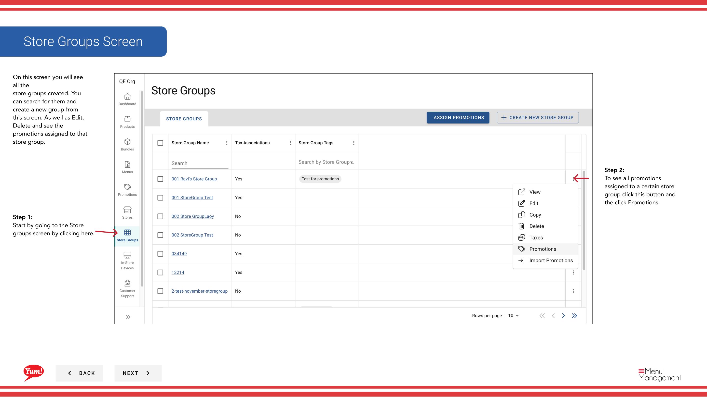
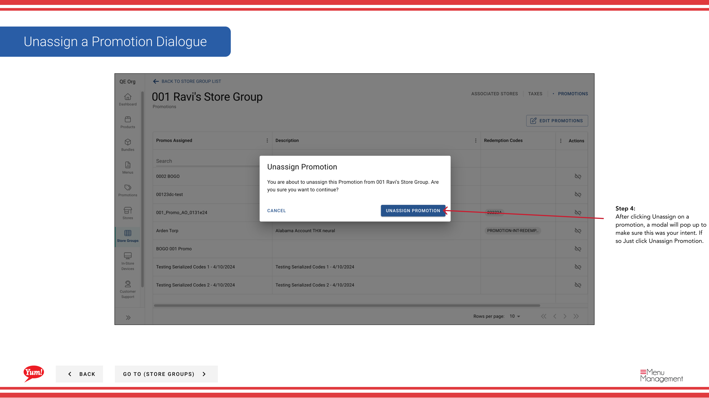

# Werbeaktionen von Store Group

## Was diese Anleitung deckt

Entfernt eine oder mehrere Promotions von einer Store-Gruppe, sofort deaktivieren sie in allen Member Stores.

## Schritte

**Step 1:** Navigieren Sie mit dem linken Navigationsmenü in den Bereich **Store Groups**.

**Step 2:** Finden Sie die Store-Gruppe, deren Promotionen Sie entfernen möchten. Klicken Sie auf die Schaltfläche **Aktionsmenü* (drei Punkte) neben dem Speichergruppennamen, dann klicken Sie auf **Promotions**.

**Step 3:** Eine Schublade wird öffnen, zeigt alle Aktionen, die derzeit dieser Speichergruppe zugeordnet. Um eine Aktion zu entfernen, klicken Sie auf die Schaltfläche **Unassign** neben dem Aktionsnamen.

**Step 4:** Ein Bestätigungsdialog wird angezeigt. Klicken Sie auf **Unassign Promotion**, um die Entfernung der Promotion von dieser Store-Gruppe zu bestätigen.

:::caution
Eine Werbeaktion zuzuweisen, deaktiviert sie sofort über alle Filialen in dieser Filialgruppe. Kunden werden diese Promotion nicht mehr auf ihren digitalen Bestellkanälen sehen.
:::

:::tip
Wenn Sie mehrere Aktionen auf einmal hinzufügen oder entfernen möchten, verwenden Sie die[Promotionen bearbeiten](/docs/admin-portal-guide/store-groups/edit-promotions/)statt.
:::

## Ähnliche Anleitungen

- [Promotionen bearbeiten](/docs/admin-portal-guide/store-groups/edit-promotions/)
- [Promotionen zuweisen](/docs/admin-portal-guide/store-groups/assign-promotions/)
- [Import Promotions für eine Store-Gruppe](/docs/admin-portal-guide/store-groups/import-promotions-for-a-store-group/)

---

* Teil der[Admin Portal Guide](/docs/admin-portal-guide)· Sektion: Store Groups*