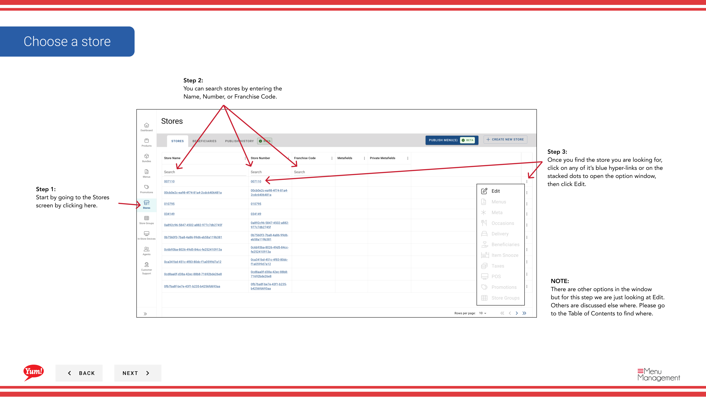

# Akzeptieren Sie Online-Bestellungen (Turn On oder Off)

## Was diese Anleitung deckt

Verbindet, ob ein Geschäft Online-Bestellungen über digitale Kanäle akzeptiert – verwendet, um die Bestellung bei Schließungen oder betrieblichen Problemen schnell zu deaktivieren.

## Schritte

**Step 1:** Navigieren Sie mit dem linken Navigationsmenü in den Abschnitt **Stores**.

**Step 2:** Suche nach dem Store nach **Name*, **Store Number** oder **Franchise Code*** mit dem Suchfeld.

**Step 3:** Wenn Sie den Speicher finden, klicken Sie auf den **store Name** (oder einen blauen Hyperlink), um die Speicherdaten anzuzeigen, oder klicken Sie auf das **dree-dot Menü* (••) Symbol und wählen Sie **Bearbeiten****.

**Step 4:** Suchen Sie die **Accepting Online Orders* toggle und setzen Sie sie auf Ihren gewünschten Zustand:
- **Ja**: Store akzeptiert Online-Bestellungen über digitale Kanäle
- **Nr*: Store akzeptiert keine Online-Bestellungen (Bestellungen sind vorübergehend deaktiviert)

**Step 5:** Klicken Sie auf die Schaltfläche ** speichern*, um die Änderung anzuwenden.

:::tip
Verwenden Sie ****, um die Bestellung während der Ladenschließungen, Systemwartung oder Personalmangel schnell zu deaktivieren, ohne andere Speichereinstellungen zu bearbeiten.
:::

:::caution
Klicken Sie auf **Cancel** zu jeder Zeit verwerfen Sie Ihre Änderung.
:::

## Ähnliche Anleitungen

- [Details zum Shop bearbeiten](/docs/admin-portal-guide/stores/edit-store-details/)— Andere Speicherinformationen aktualisieren

---

* Teil der[Admin Portal Guide](/docs/admin-portal-guide)· Abschnitt: Geschäfte*