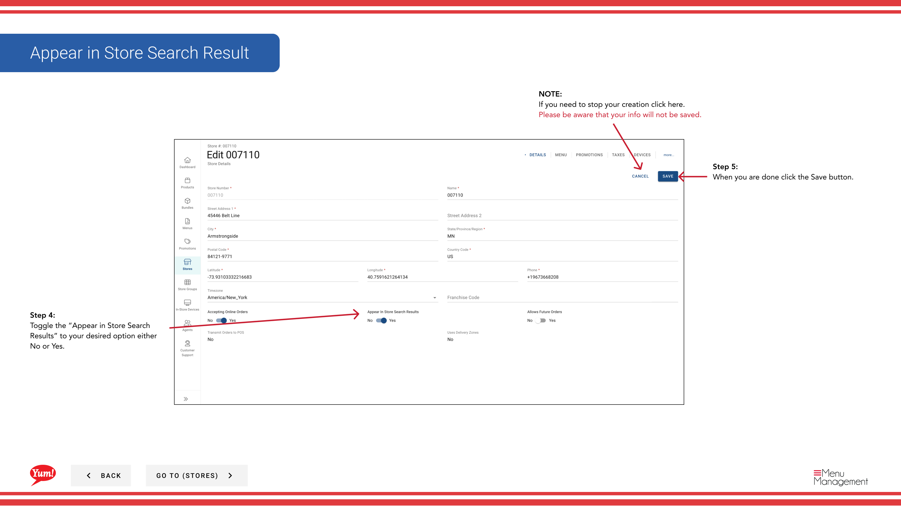

# Erscheinen Sie in Suchergebnis (auf oder ab)

## Was diese Anleitung deckt

Kontrolliert, ob ein Geschäft in kundenorientierten Suchergebnissen erscheint, so dass Betreiber einen Standort verstecken, ohne ihn vollständig zu entfernen.

## Schritte

**Step 1:** Navigieren Sie mit dem linken Navigationsmenü in den Abschnitt **Stores**.

**Step 2:** Suche nach dem Store nach **Name*, **Store Number** oder **Franchise Code*** mit dem Suchfeld.

**Step 3:** Wenn Sie den Speicher finden, klicken Sie auf den **store Name** (oder einen blauen Hyperlink), um die Speicherdaten anzuzeigen, oder klicken Sie auf das **dree-dot Menü* (••) Symbol und wählen Sie **Bearbeiten****.

**Step 4:** Suchen Sie die **Appear in Store Suchergebnisse** toggle und setzen Sie sie auf Ihren gewünschten Zustand:
- **Ja**: Store erscheint in Kunden-Suchergebnissen
- ** Nein**: Store ist vor Kunden-Suchergebnissen verborgen, wird aber nicht gelöscht

**Step 5:** Klicken Sie auf die Schaltfläche ** speichern*, um die Änderung anzuwenden.

:::tip
Verwenden Sie ****, um vorübergehend einen Standort von Kunden zu verstecken, während es in Atlas für administrative Zwecke (z.B. bei Renovierungen, saisonalen Schließungen, oder bei der Vorbereitung eines neuen Standorts vor dem Start).
:::

:::caution
Klicken Sie auf **Cancel** zu jeder Zeit verwerfen Sie Ihre Änderung.
:::

## Ähnliche Anleitungen

- [Details zum Shop bearbeiten](/docs/admin-portal-guide/stores/edit-store-details/)— Andere Speicherinformationen aktualisieren
- [Akzeptieren Sie Online-Bestellungen (Turn On oder Off)](/docs/admin-portal-guide/stores/2a-accept-online-orders-turn-on-or-off/)— Abnahme der Bestellungen getrennt

---

* Teil der[Admin Portal Guide](/docs/admin-portal-guide)· Abschnitt: Geschäfte*