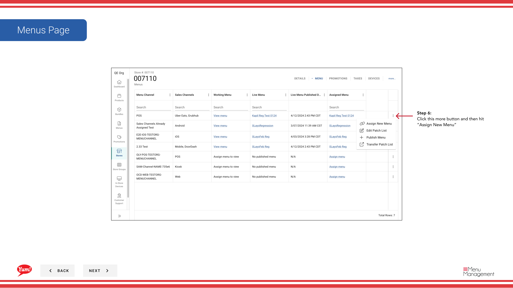

# Neues Menü zuordnen

## Was diese Anleitung deckt

Verlinkt ein publiziertes Menü in den Bestellkanal eines Ladens (z.B. Digital, Kiosk, In-Store), was Kunden bei der Bestellung von diesem Standort sehen.

## Schritte

**Step 1:** Navigieren Sie mit dem linken Navigationsmenü in den Abschnitt **Stores**.

**Step 2:** Suche nach dem Store nach **Name*, **Store Number** oder **Franchise Code*** mit dem Suchfeld.

**Step 3:** Sobald Sie den Speicher finden, klicken Sie auf das **dree-dot Menü* (••) Symbol, um das Optionen Menü zu öffnen.

**Step 4:** Klicken Sie auf **Menus** im Dropdown-Menü.

**Step 5:** Klicken Sie auf die **mehr Menü* Schaltfläche (⋯) oder **+ Neue Menü** Schaltfläche, um weitere Optionen zu zeigen.

**Step 6:** Klicken Sie auf **Assign New Menu**.

**Step 7:** Wählen Sie ein veröffentlichtes Menü aus der Liste. Dieses Menü wird einem bestimmten Bestellkanal für diesen Speicher zugeordnet.

| Feld | Eingeben | Anmerkungen |
|-------|--------------|-------|
| **Menu*** | Wählen Sie aus veröffentlichten Menüs | Nur veröffentlichte Menüs erscheinen hier |
| **Channel*** | Wählen Sie den Bestellkanal | z.B. Digital, Kiosk, In-Store |

**Step 8:** Klicken Sie auf **Assign**, um die Zuordnung zu bestätigen.

:::tip
Nur veröffentlichte Menüs stehen zur Verfügung. Wenn das gewünschte Menü nicht in der Liste ist, veröffentlichen Sie es zuerst mit[Menü veröffentlichen](/docs/admin-portal-guide/stores/publish-a-menu/).
:::

:::tip
Jeder Speicher kann verschiedene Menüs verschiedenen Kanälen zugeordnet haben. Beispielsweise kann Ihr Digital-Kanal ein Menü verwenden, während Ihr In-Store Kiosk ein anderes verwendet.
:::

## Ähnliche Anleitungen

- [Menü eines Stores anzeigen](/docs/admin-portal-guide/stores/view-a-stores-menu/)— Welche Menüs einem Speicher zugeordnet sind
- [Menü veröffentlichen](/docs/admin-portal-guide/stores/publish-a-menu/)— Machen Sie ein Menü live nach der Zuordnung

---

* Teil der[Admin Portal Guide](/docs/admin-portal-guide)· Abschnitt: Geschäfte*