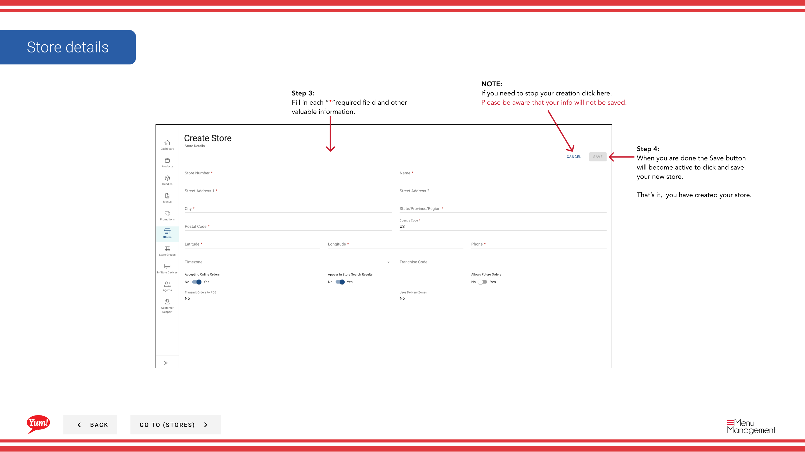

# Erstellen eines Stores

## Was diese Anleitung deckt

Registriert einen neuen Speicherplatz in Atlas mit seinen erforderlichen Details, so dass er für Menüzuordnung und digitale Bestellung zur Verfügung steht.

## Schritte

**Step 1:** Navigieren Sie mit dem linken Navigationsmenü in den Abschnitt **Stores**.

**Step 2:** Klicken Sie auf die Schaltfläche **+ Neuen Store** in der oberen rechten Ecke des Bildschirms erstellen.

**Step 3:** Füllen Sie das Bestellformular aus. Mit * markierte Felder sind erforderlich.

| Feld | Eingeben | Anmerkungen |
|-------|--------------|-------|
| ** Store Name*** | Voller Anzeigename des Speichers | z.B. „KFC George Street Sydney“ |
| ** Lagernummer*** | Einzigartige numerische Kennung, die von Marktgeschäften vergeben wird | Muss mit der Byte POS zugewiesenen Speichernummer übereinstimmen, oder der durch Byte Connect für nicht-Byte POS-Märkte verwendete Kartenspeicherkennung |
| **Franchise Code** | Alphanumerischer Code zur Identifizierung des Franchisees | Bildmaterial von Ihrem regionalen Manager |
| **Zeitzone** | Lokale Zeitzone des Ladens | Erforderlich für item snooze und zukünftige Auftragsgenauigkeit |

**Step 4:** Sobald alle erforderlichen Felder abgeschlossen sind, wird die **Save** Taste aktiv. Klicken Sie auf **Save**, um den Speicher zu erstellen.

:::tip
Bevor Sie einen neuen Speicher erstellen, suchen Sie die Stores-Liste nach Name, Nummer oder Franchise Code, um zu bestätigen, dass es nicht bereits existiert.
:::

:::note Byte POS Caveat
Wenn der Markt nicht Byte POS verwendet, gehen Sie nicht davon aus, dass Byte Commerce direkt mit dem Markt POS aus dem Geschäft Rekord allein verbinden wird. **Byte Connect** muss im Rahmen von Byte Commerce an Bord sein.
:::

:::caution
Klicken Sie auf **Cancel** zu jeder Zeit verworfen alle nicht gespeicherten Informationen.
:::

## Ähnliche Anleitungen

- [Details zum Shop bearbeiten](/docs/admin-portal-guide/stores/edit-store-details/)— Aktualisieren Sie den Speicher nach der Erstellung
- [Neues Menü zuordnen](/docs/admin-portal-guide/stores/assign-new-menu/)— Verlinken Sie ein Menü in den neuen Store

---

* Teil der[Admin Portal Guide](/docs/admin-portal-guide)· Abschnitt: Geschäfte*
