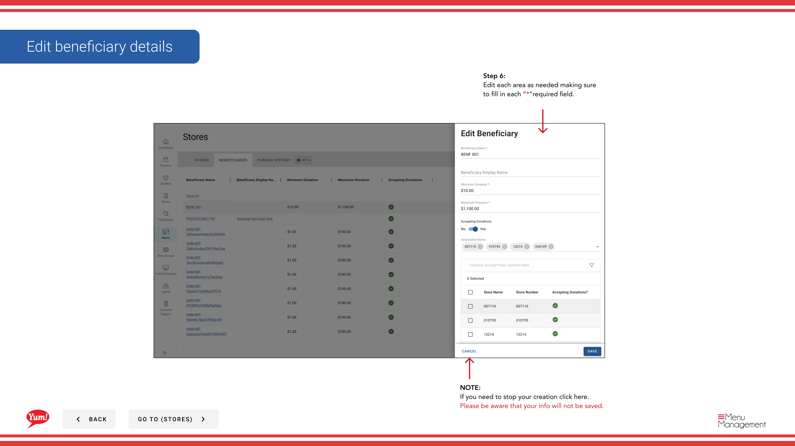

# Bearbeiten/Entlassen eines Steuerempfängers

## Was diese Anleitung deckt

Aktualisiert oder entfernt einen vorhandenen Empfängerdatensatz, einschließlich seines Namens, Spendestatus und dazugehöriger Geschäfte.

## Schritte

**Step 1:** Navigieren Sie mit dem linken Navigationsmenü in den Abschnitt **Stores**.

**Step 2:** Klicken Sie auf die Registerkarte **Beneficiaries* auf der Seite Stores.

**Step 3:** Verwenden Sie das Suchfeld, um den Empfänger mit **name* zu finden, oder scrollen Sie durch die Liste.

**Step 4:** Sobald Sie den Empfänger finden, klicken Sie auf das **dree-dot-Menü* (••)-Symbol in der Zeile des Empfängers, um das Optionen-Menü zu öffnen.

### Zum Bearbeiten:

**Step 5:** Klicken Sie auf **Bearbeiten**, um das Formular für die Empfängerdetails zu öffnen.

**Step 6:** Aktualisieren Sie die Empfängerfelder nach Bedarf. Alle mit * markierten Felder sind erforderlich.

| Feld | Eingeben | Anmerkungen |
|-------|--------------|-------|
| **Benefizienz*** | Name der Nächstenliebe oder Ursache | z.B. „KFC Youth Foundation“ |
| ** Spenden akzeptieren** | Toggle: Ja oder Nein | Kontrolliert, ob Spenden aktiv sind |
| **Vereinigte Geschäfte** | Wählen Sie die Stores | Verwenden Sie die Suche, um Geschäfte von diesem Empfänger hinzuzufügen oder zu entfernen |

**Step 7:** Wenn Änderungen abgeschlossen sind, klicken Sie auf **Save**, um den Empfänger zu aktualisieren.

### Zum Löschen:

**Step 5:** Klicken Sie auf **Delete** im Menü Optionen.

**Step 6:** Bestätigen Sie die Löschung im Modal, das durch erneutes Anklicken von **Delete** angezeigt wird. Diese Aktion kann nicht rückgängig gemacht werden.

:::caution
Ein Empfänger kann nicht rückgängig gemacht werden. Um einen Begünstigten vorübergehend zu deaktivieren, setzen Sie **Akzeptieren Spenden** auf *** statt.
:::

:::caution
Klicken Sie auf **Cancel** zu jeder Zeit verweigern Sie ungewollte Änderungen (nur Bearbeiten Modus).
:::

## Ähnliche Anleitungen

- [Nutzen eines Stores anzeigen](/docs/admin-portal-guide/stores/view-a-stores-beneficiaries/)— Alle Begünstigten, die mit einem Geschäft verbunden sind
- [Beneficiary erstellen](/docs/admin-portal-guide/stores/create-a-beneficiary/)— Einrichtung eines neuen Begünstigten

---

* Teil der[Admin Portal Guide](/docs/admin-portal-guide)· Abschnitt: Geschäfte*