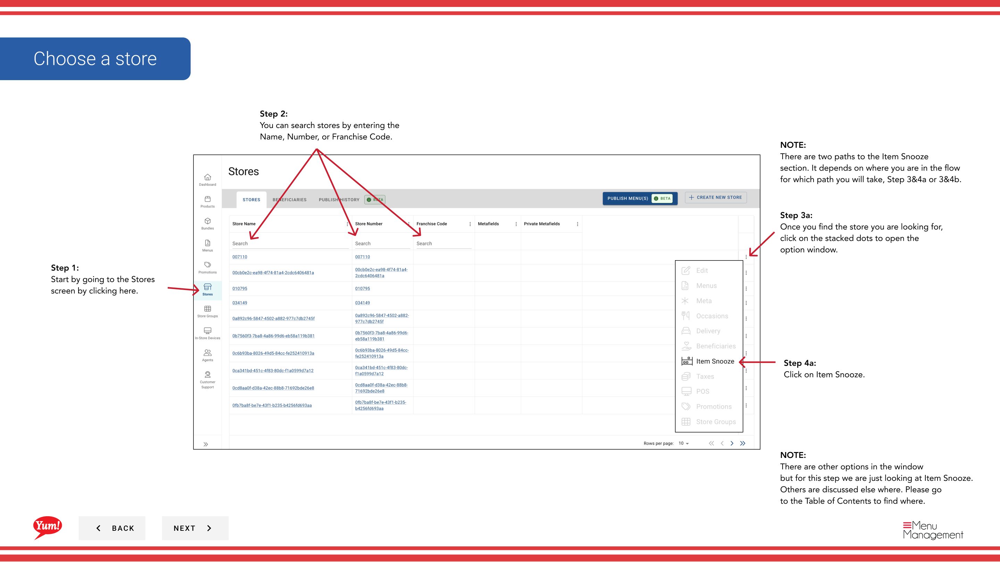
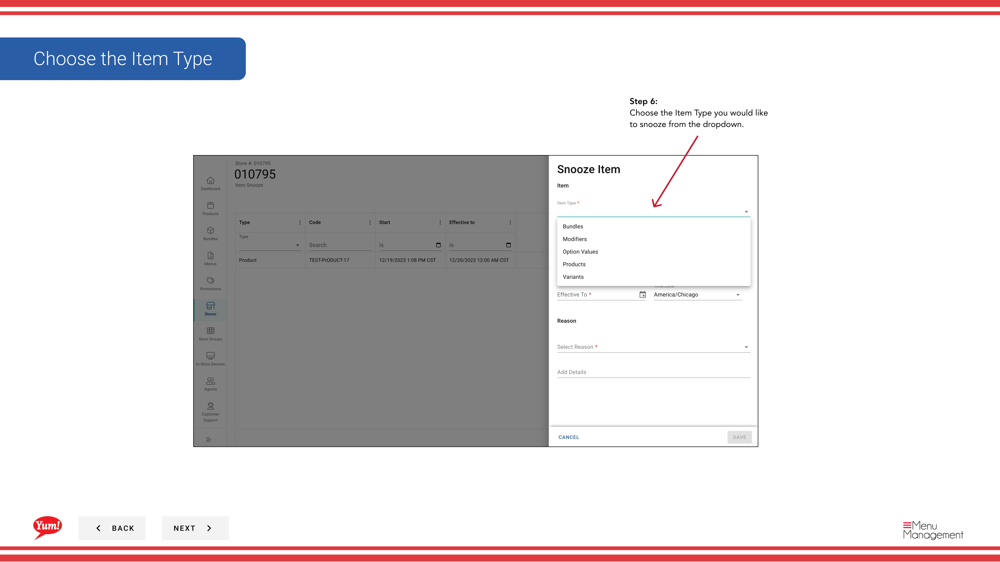

# Artikel Snooze

## Was diese Anleitung deckt

Entfernt vorübergehend einen bestimmten Artikel aus dem Menü eines Speichers für einen bestimmten Zeitraum und Grund (z.B. Lagerausfall oder Geräteausfall), so dass er automatisch zurückkehrt, wenn die Snooze-Periode endet.

## Schritte

**Step 1:** Navigieren Sie mit dem linken Navigationsmenü in den Abschnitt **Stores**.

**Step 2:** Suche nach dem Store nach **Name*, **Store Number** oder **Franchise Code*** mit dem Suchfeld.

**Step 3:** Sobald Sie den Speicher finden, klicken Sie auf das **dree-dot Menü* (••) Symbol, um das Optionen Menü zu öffnen.

**Step 4:** Klicken Sie im Dropdown-Menü auf **Item Snooze**. Wenn Sie diese Option nicht sofort sehen, klicken Sie auf die Schaltfläche **mehr** (.) um weitere Optionen zu zeigen.

**Step 5:** Klicken Sie auf die **+ Artikel hinzufügen** Schaltfläche, um einen neuen Artikel einzuschnüffeln.

**Step 6:** Füllen Sie das Artikel-Snooze-Form mit den folgenden Feldbeschreibungen. Mit * markierte Felder sind erforderlich.

| Feld | Eingeben | Anmerkungen |
|-------|--------------|-------|
| **Ihr Typ*** | Wählen Sie aus dem Dropdown | Normalerweise „Produkt“ oder „Bundle“ |
| * | Suchen und wählen Sie den Artikel aus | Geben Sie mindestens 3 Zeichen zur Suche ein. z.B. „Crispy Chicken Sandwich“ |
| ** Enddatum*** | Datum und Uhrzeit, wenn der Artikel in das Menü zurückkehrt | Die Schnauze beginnt sofort, wenn sie gespeichert wird; sie kann nicht für einen zukünftigen Start geplant werden |
| **Reason*** | Wählen Sie aus dem Dropdown | z.B. „Ausverkauft“, „Ausrüstungsversagen“, „Temporary Removal“ |
| ** Details hinzufügen* | Optionale Freitexterklärung | z.B. „Lieferantenlieferung verzögert bis Freitag“ |

**Step 7:** Sobald alle erforderlichen Felder abgeschlossen sind, klicken Sie auf **Save**, um den Snooze zu aktivieren.

:::caution
- Die Schnauze wirkt ** sofort**, wenn Sie auf Speichern klicken – es kann nicht geplant, später zu starten.
- Wenn die **Time Zone** Ihrer Filiale nicht konfiguriert ist, müssen Sie sie vor dem Erstellen von Snoozed-Elementen festlegen.
:::

:::tip
Benutzen Sie das Feld ** Details**, um zu dokumentieren, warum der Artikel gesungen wurde. Dies hilft anderen Managern, den Grund zu verstehen, wenn man Snoozed-Elemente später betrachtet.
:::

## Ähnliche Anleitungen

- [Details zum Shop bearbeiten](/docs/admin-portal-guide/stores/edit-store-details/)— Konfigurieren Sie die Zeitzone Ihres Stores
- [Menü eines Stores anzeigen](/docs/admin-portal-guide/stores/view-a-stores-menu/)— Alle Artikel und deren Snooze-Status anzeigen

---

* Teil der[Admin Portal Guide](/docs/admin-portal-guide)· Abschnitt: Geschäfte*